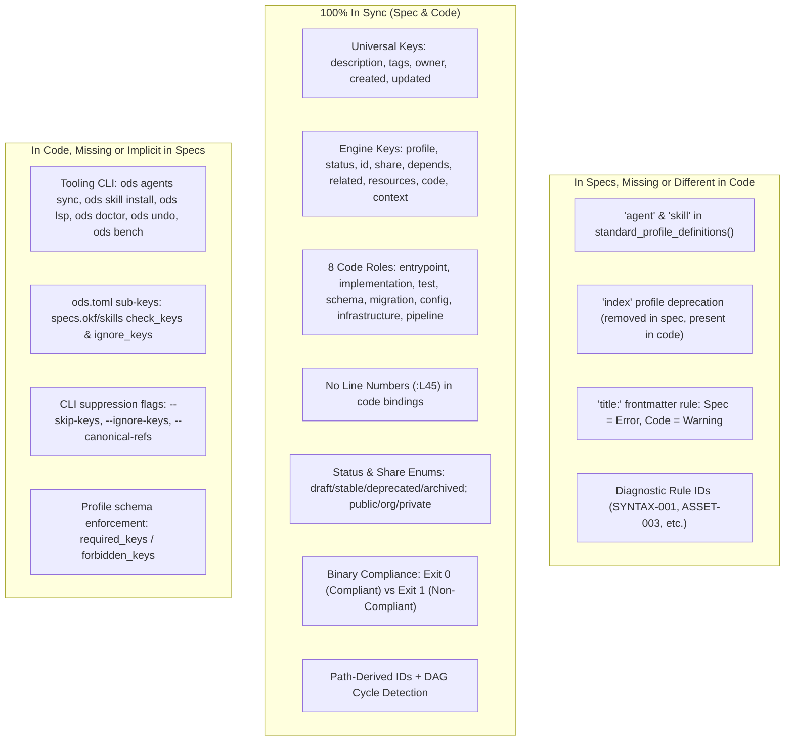

# ODS Codebase vs Specification Alignment Plan

This document details the comparative audit and alignment strategy between the **ODS implementation** (`open-doc-spec/ods`) and the **ODS formal specification** (`open-doc-spec/ods-spec`).

---

## 1. Direct Verification: `created` and `updated` Keys

> **Status**: **YES — Fully Aligned**. Both `created` and `updated` are specified in the formal specifications and implemented in the codebase as **Tier 1: Universal Top-Level Keys**.

### Specification Declarations
- **`specs/keys.md`**:
  - Listed in **Section 2 (Author Cheat Sheet)** and **Section 3 (3-Tier Layering Architecture)** as universal top-level keys.
  - Detailed in **Section 6.4 (`created` and `updated`)** with normative rules and timestamp formatting (`YYYY-MM-DD` or ISO-8601).
  - Recognizes `last_updated`, `created_at`, `date`, and `updated_at` as aliases.
- **`specs/scope.md`**: Section 2 (Table of non-goals: *"No Mandatory Hand-Maintained Timestamps — Git is authoritative, but `updated`/`created` are supported for exports"*).
- **`specs/validation.md`**: Line 190 in the Implementer Conformance Checklist (*"Enforce top-level placement for `description`, `tags`, `owner`, `created`, `updated`"*).
- **`AGENTS.md`**: Rule 1.2 (*"Universal keys (`description`, `tags`, `owner`, `created`, `updated`) MUST be placed at the top level of frontmatter"*).

### Codebase Implementations
- **`model/mod.rs`**: `Frontmatter.created: Option<String>` and `Frontmatter.updated: Option<String>`.
- **`parse/frontmatter.rs`**: Parses `created`, `created_at`, `date`, `updated`, `last_updated`, and `updated_at`.
- **`spec/schema.rs`**: Registered as `KeyPlacement::TopLevel` and `KeyType::Timestamp` with standard aliases.
- **`lint/checker.rs`**: Validates date format string via `is_valid_date_str`.

---

## 2. In-Depth Comparative Audit Matrix

---

## 3. Discrepancy Breakdown

### Category A: In SPECS but MISSING or DIFFERENT in CODE

| Feature / Area | Specification (`ods-spec`) | Implementation (`ods`) | Discrepancy & Impact |
| :--- | :--- | :--- | :--- |
| **`agent` Profile** | Defined in `specs/profiles.md` & `AGENTS.md` with 15 expected H2/H3 sections (`Goal`, `Task`, `Scope`, `Non-Scope`, `Context`, `Inputs`, `Constraints`, `Priority`, `Steps`, `Output`, `Success Criteria`, `Failure Modes`, `Dependencies`, `Assumptions`, `Examples`). | Missing from `standard_profile_definitions()` in `src/ods-core/src/profiles/mod.rs`. | Authoring `agent.md` with `ods: profile: agent` triggers an `unknown profile` lint warning unless custom profile is defined. |
| **`skill` Profile** | Defined in `specs/profiles.md` & `AGENTS.md` with 16 expected H2/H3 sections (`Purpose`, `Capability`, `Activation`, `Scope`, `Non-Scope`, `Inputs`, `Outputs`, `Workflow`, `Rules`, `Priority`, `Validation`, `Eval`, `Resources`, `Tools`, `Lifecycle`, `Traceability`). | Handled only in `multi_spec/skills/` crate; not registered in built-in `standard_profile_definitions()` in `profiles/mod.rs`. | Standard ODS lint without `--skills` treats `profile: skill` as unknown. |
| **`index` Profile** | Deprecated / eliminated from standard profiles in `specs/scope.md` & `specs/indexes.md`. | Still defined as a built-in profile `profile("index", vec![])` in `profiles/mod.rs`. | Legacy profile definition remaining in codebase. |
| **`title:` Frontmatter Severity** | `specs/validation.md` Rule `SYNTAX-002` lists frontmatter `title:` as **Error** (Severity: Error, exit code 1). | `spec/schema.rs` emits `Severity::Warning` (`lint_title_discouraged`). | Code is more lenient than spec to prevent breaking legacy markdown during initial adoption. |
| **Rule Identifiers in Diagnostics** | `specs/validation.md` defines standard rule IDs (`SYNTAX-001`, `PLACE-001`, `ENUM-001`, `GRAPH-004`, `ASSET-003`, etc.). | `error/messages.rs` uses internal snake_case IDs (`invalid_status`, `dangling_reference`) under `ODS_ERROR_CODES=1`. | Diagnostic error messages do not surface the uppercase spec IDs by default. |

---

### Category B: In CODE but MISSING or NOT DOCUMENTED in SPECS

| Feature / Subsystem | In Codebase (`ods`) | Status in Specs (`ods-spec`) | Recommendation |
| :--- | :--- | :--- | :--- |
| **`ods agents sync`** | CLI command generating/updating root `AGENTS.md`, `.claude/opendocify-agents.md`, and `.cursor/opendocify-agents.mdc`. | Not documented in `specs/` chapters (only root `AGENTS.md` is present). | Document in `specs/indexes.md` or a tooling addendum. |
| **`ods skill install`** | Installs ODS skill contracts into 7 AI agent environments (`claude-code`, `cursor`, `antigravity`, `codex`, `gemini-cli`, `windsurf`, `copilot`). | Not mentioned in `specs/`. | Mention under Tooling Ecosystem in `specs/README.md`. |
| **LSP Server (`ods lsp`)** | Full Language Server Protocol over stdio for IDE completions, hover diagnostics, and jump-to-definition. | Not mentioned in `specs/`. | Document under Implementer Conformance in `specs/validation.md`. |
| **`[specs.okf]` & `[specs.skills]` Config Options** | `check_keys = bool`, `ignore_keys = [...]` in `ods.toml` + CLI flags `--skip-keys`, `--ignore-keys`. | `specs/indexes.md` only shows `enabled = false`. | Document the key-checking sub-options in `specs/indexes.md`. |
| **Workspace Maintenance Commands** | `ods doctor`, `ods undo`, `ods diff`, `ods schema`, `ods clean`, `ods bench`, `ods setup`, `ods upgrade`. | Specs focus primarily on the core spec operations (`lint`, `context`, `find`, `mv`, `rm`, `adopt`, `fmt`). | Document these operational tools in CLI tooling reference. |
| **Profile Authoring Frontmatter** | `ods.custom_profile` with `name`, `required_keys`, `optional_keys`, and `forbidden_keys` used when authoring custom profile documents. | Documented in `specs/profiles.md`, `specs/keys.md`, and `specs/validation.md`; runtime enforcement and conformance coverage are addressed by [open-doc-spec/ods#50](https://github.com/open-doc-spec/ods/pull/50). | Keep the specification and implementation changes synchronized; merge the linked implementation PR with this documentation update. |

---

### Category C: 100% In Sync (Spec & Code Parity)

1. **Universal Keys**: `description`, `tags`, `owner`, `created`, `updated`.
2. **Timestamp Aliases**: `created_at`, `date` $\to$ `created`; `last_updated`, `updated_at` $\to$ `updated`.
3. **ODS Engine Subsystems & Keys**: `profile`, `status`, `id`, `share`, `depends`, `related`, `resources`, `code`, `context` (`load`, `ignore`, `max-depth`).
4. **8 Code Roles**: `entrypoint`, `implementation`, `test`, `schema`, `migration`, `config`, `infrastructure`, `pipeline`.
5. **No Line Numbers in Code Bindings**: Prohibiting `:L45` / `#L10` in code paths is enforced in both.
6. **Lifecycle Statuses**: `draft`, `stable`, `deprecated`, `archived`.
7. **Share Visibilities**: `public`, `org`, `private`.
8. **Binary Compliance**: Pass (0) / Fail (1) model with no compliance ladder.
9. **Path-Derived Document IDs**: File path minus `.md`, normalized with forward slashes `/`.
10. **DAG Cycle Detection**: DFS cycle detection on `depends` with acyclicity required.
11. **Bounded AI Context Expansion Algorithm**: Walks `depends` up to `max-depth` (default 2), loads `context.load`, prunes `context.ignore` and `share: private`, bundles `code` when requested.

---

## 4. Actionable 3-Step Synchronization Plan

### Step 1: Align `ods` Codebase with Spec Profiles
1. **Add `agent` and `skill` Profiles**: Add standard profile definitions to `ods-core/src/profiles/mod.rs` `standard_profile_definitions()` with their canonical section headings and aliases.
2. **Deprecate `index` Profile**: Remove `index` from standard profile definitions or mark as legacy.
3. **Review `title:` Severity**: Consider adding a strict mode or updating documentation explaining why `title:` remains a warning for non-destructive adoption.

### Step 2: Document Missing Code Capabilities in `ods-spec`
1. **Update `specs/indexes.md`**: Include `[specs.okf]` and `[specs.skills]` configuration tables with `check_keys` and `ignore_keys`.
2. **Update `specs/keys.md`**: Add `ods.custom_profile` with `name`, `required_keys`, `optional_keys`, and `forbidden_keys` under Custom Profile Definition keys (documented by this alignment update).
3. **Update `specs/README.md`**: Add an overview of extended CLI tooling (`agents sync`, `skill install`, `lsp`, `doctor`).

### Step 3: CI and Verification
1. Run `ods lint` across all documentation in `ods-spec`.
2. Run `cargo test` in `ods` repository to ensure zero regressions across all unit and CLI test suites.
