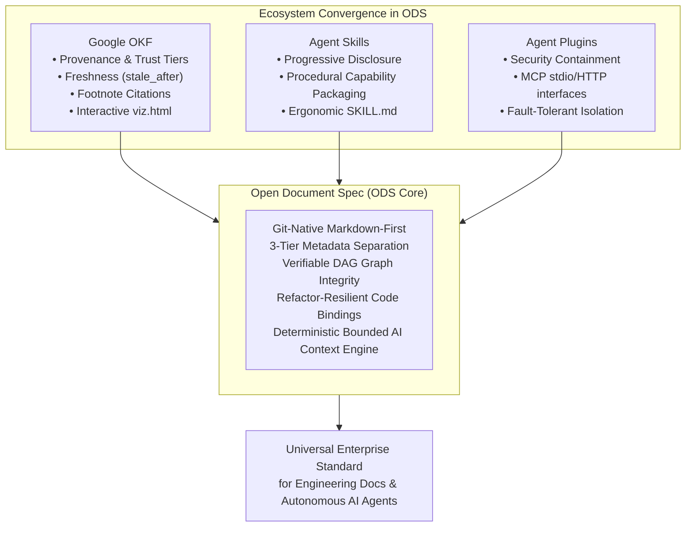

# Executive Summary: Comparative Spec Analysis & ODS Improvement Strategy

## 1. Context & Motivation

As AI coding agents (such as Claude Code, Cursor, Antigravity, GitHub Copilot, Codex, and Windsurf) transition from ad-hoc chat assistants into autonomous software collaborators, organizations face an urgent architectural challenge: **how to represent, verify, package, and retrieve knowledge and capabilities across the engineering lifecycle.**

Multiple open specifications have emerged to address distinct facets of this challenge:
1. **Agent Skills Specification (`agentskills`)**: Developed originally by Anthropic as an open standard for giving agents procedural capabilities, executable scripts, and focused domain instructions via progressive disclosure (`SKILL.md`).
2. **Agent Plugins Specification (`agent-plugins-spec`)**: A vendor-neutral standard for packaging reusable agent components (Skills and Model Context Protocol servers) into distributable directory units with strict boundary containment (`plugin.json`, `mcp.json`).
3. **Google Open Knowledge Format (`knowledge-catalog/okf`)**: Developed by Google Cloud / Dataplex as an open, agent-friendly knowledge format focused on data catalog context, multi-author provenance, credibility signals, trust tiers, freshness gates, and verifiable Attested Computations.
4. **Open Document Spec (`ods-spec`)**: A Git-native, Markdown-first specification for software engineering documentation, establishing 3-tier metadata separation, verifiable Directed Acyclic Graph (DAG) dependencies, code symbol bindings without fragile line numbers, and deterministic bounded AI context extraction.

This report synthesizes an exhaustive, deep-dive comparative study across these four specifications to identify:
- **What architectural gaps exist in Open Document Spec (ODS)**.
- **Why specific paradigms from Google OKF, Agent Skills, and Agent Plugins should be incorporated into ODS**.
- **How to implement these enhancements** without compromising ODS's core design principles.
- **How to make ODS maximally reliable, robust, and adoption-ready** across developer teams and AI agent ecosystems.

---

## 2. Exhaustive 4-Way Specification Comparison Matrix

The following matrix provides a comprehensive architectural comparison across all four specifications:

| Architectural Dimension | Open Document Spec (ODS) | Agent Skills (`agentskills`) | Agent Plugins (`agent-plugins-spec`) | Google OKF (`knowledge-catalog/okf`) | Key Takeaway & ODS Vector |
| :--- | :--- | :--- | :--- | :--- | :--- |
| **Primary Domain & Focus** | General software engineering docs, architecture, ADRs, PRDs, SOPs, AI prompt & skill contracts. | Reusable procedural task instructions and executable capabilities for agents. | Packaging and runtime distribution of Skills and MCP servers. | Data catalogs, enterprise metadata, verified analytics, and agent-maintained knowledge. | ODS bridges human docs and agent knowledge. |
| **Document Format Model** | Plain Markdown (`.md`) with optional YAML frontmatter & root `ods.toml`. | Folder with `SKILL.md` + optional `scripts/`, `references/`, `assets/`. | Directory package with `plugin.json`, `skills/`, `mcp.json`, and client extensions. | Directory tree of plain Markdown (`.md`) with YAML frontmatter + `index.md`. | All favor Markdown + YAML; ODS provides the most formal frontmatter layering. |
| **Metadata Layering & Scoping** | **3-Tier Strict Layering**: Universal top-level, engine keys under `ods:`, workspace in `ods.toml`. | Flat frontmatter: `name`, `description`, `license`, `compatibility`, `metadata`, `allowed-tools`. | Manifest object `plugin.json` (closed schema); client extensions under reverse-domain keys. | Top-level YAML frontmatter (`type`, `title`, `description`, `sources`, `generated`, `verified`, etc.). | ODS's 3-tier model prevents SSG collision; can gracefully accommodate OKF/Skill keys. |
| **Document Identity** | **Path-derived ID** (workspace-relative minus `.md`) + optional `ods.id` for rename stability. | Matches parent directory name (`name`). | Package directory name (`name`). | **Path-derived Concept ID** (path relative to bundle root minus `.md`). | ODS and OKF share identical path-derived ID philosophy. |
| **Knowledge Graph & Relationships** | **Explicit DAG edges**: `ods.depends` (hard prerequisite, strict DAG) & `ods.related` (soft link). | Relative file links in markdown body; one level deep. | Fixed filesystem directory layout (`skills/`, `mcp.json`). | Untyped standard Markdown cross-links; parent/child directory hierarchy; `references/`. | ODS has the most advanced, verifiable DAG graph engine. |
| **Provenance & Attribution** | Top-level `owner` (team/handle) and `created`/`updated` dates. | Optional `metadata.author` and `license`. | `author: { name, email, url }`, `license`, `repository`. | **First-Class Multi-Author**: `generated: { by, at }`, `verified: [{ by, at }]`, Actor convention (`<agent>/<ver>`, `human:<id>`, `process:<id>`). | **Major ODS Improvement**: Adopt OKF's `generated` vs `verified` and Actor conventions. |
| **Trust Evaluation** | Binary workspace compliance (`ods lint` exit 0/1). | Validation via `skills-ref validate`. | Validation against JSON Schemas; non-fatal component isolation. | **Dynamic Trust Tiers**: Derived automatically as Unverified $\to$ Machine-Confirmed $\to$ Human-Reviewed. | **Major ODS Improvement**: Derive Trust Tiers from verification metadata. |
| **Freshness & Expiration** | Lifecycle enum: `ods.status: [draft, stable, deprecated, archived]`. | None (assumed current). | SemVer `version` string for update checks. | **Deterministic Temporal Gate**: `stale_after: <ISO-8601 UTC instant>` + `status`. | **Major ODS Improvement**: Add `stale_after` for automated staleness alerts. |
| **External Citations & Traceability** | `ods.resources` (local file paths only). | `references/` markdown files. | `homepage`, `repository` URLs. | **Structured Sources & Footnotes**: `sources: [{ id, resource, author, usage_count, ... }]` joined to body footnotes (`[^id]`). | **Major ODS Improvement**: Add `sources` + footnote joins for verified claim citations. |
| **Code & Implementation Bindings** | **`ods.code`**: Refactor-resilient relative paths, 8 standard roles, `symbol` field; forbidden line numbers (`:L45`). | Bundled scripts under `scripts/` executed by agent. | MCP stdio command execution (`command`, `args`, `env`, `cwd`). | Standalone `references/` code + `Attested Computation` bindings. | ODS has best static code binding model; can incorporate runtime execution recipes. |
| **Verifiable Execution** | Static binding verification in CI via `ods lint` (`ASSET-002`). | Agent follows procedural steps; scripts run on demand. | Stdio / HTTP MCP protocol execution. | **Attested Computation**: `runtime`, `parameters`, `receipt`, `attester` (deterministic run verification). | **Major ODS Improvement**: Support Attested Execution for SOPs and runbooks. |
| **AI Context Assembly** | **Bounded Context Engine** (`ods context`): Graph traversal up to `max-depth`, `load` injection, `ignore`/`share` pruning. | **Progressive Disclosure**: Stage 1 (~100 token summary) $\to$ Stage 2 (<5k token body) $\to$ Stage 3 (resources on demand). | Progressive loading of skills and MCP tool definitions. | Progressive directory traversal via hierarchical `index.md` files. | ODS algorithm is most deterministic; can formalize progressive disclosure tiers. |
| **Security Containment & Sandboxing** | Path existence check; basic ignore filtering. | Recommended 1-level relative links. | **Strict Package Containment**: Reject any path resolving outside package root; `${PLUGIN_DATA}` persistence. | Path existence check within bundle. | **Major ODS Improvement**: Enforce strict filesystem containment to prevent directory traversal. |
| **Visualization & UX** | CLI graph output (DOT, Mermaid, ASCII). | Client showcase website. | Web catalog showcase. | **Zero-Install Interactive Visualizer**: Single-file standalone HTML (`viz.html`) with Cytoscape.js force graph, filters, backlinks. | **Major ODS Improvement**: Implement `ods viz` for instant browser-based DAG exploration. |
| **Tooling & IDE Ecosystem** | Rust CLI (`ods`), JSON Schemas (Draft 2020-12), LSP server (`ods lsp`). | Python reference library (`skills-ref`), web docs. | JSON Schemas (1.0/1.1), client integrations. | Python reference agent (`reference_agent`), BQ crawler, web enrichment. | **Major ODS Improvement**: Ship official `ods-mcp` server and pre-commit/CI integrations. |

---

## 3. Core Strategic Value & Positioning of ODS

### ODS's Unique Architectural Strengths
1. **Zero-Friction Git Markdown-First Philosophy**: Unlike proprietary knowledge graphs or database catalogs, ODS documents remain ordinary `.md` files that live alongside code in Git, participating in code reviews, pull requests, and Git blame.
2. **Strict 3-Tier Metadata Layering**: Separating universal metadata (`description`, `tags`, `owner`), engine subsystems (`ods:` block), and repository boundary configuration (`ods.toml`) prevents keyword collisions with Static Site Generators (SSGs) and keeps frontmatter clean.
3. **Verifiable DAG Knowledge Graph**: Using `ods.depends` for hard prerequisites and `ods.related` for associative links provides a formal Directed Acyclic Graph that can be topologically sorted and verified in CI for zero cyclic deadlocks.
4. **Refactor-Resilient Code Bindings**: By binding documentation to symbols (`symbol: processRefund`) rather than line numbers (`:L45`), ODS documentation does not break when preceding lines in source files are modified.
5. **Deterministic Bounded AI Context Resolution**: Instead of relying solely on vector similarity search (which frequently retrieves stale fragments or misses fundamental prerequisites), `ods context` deterministically gathers exact topological prerequisites within a token budget.

---

## 4. Key Improvement Vectors for ODS (Summary)

Based on the comparative audit, the strategic roadmap for ODS focuses on four foundational modernization pillars:

### Pillar 1: Provenance, Trust & Freshness (Google OKF Integration)
- **Multi-Author Provenance**: Introduce `generated: { by, at }` and `verified: [{ by, at }]` using standard Actor syntax (`reference_agent/gemini-2.5-pro`, `human:alice`, `process:ci-sync`).
- **Automated Trust Tiers**: Automatically categorize documents into **Unverified**, **Machine-Confirmed**, and **Human-Reviewed** based on verification history.
- **Deterministic Freshness Gate (`stale_after`)**: Allow authors to set an expiration timestamp (`stale_after: 2026-12-31T00:00:00Z`). Enable `ods lint` and `ods context` to flag stale architectural documents automatically.
- **Footnote Claim Citations**: Support structured `sources` metadata joined to Markdown body footnotes (`[^source-id]`) with objective credibility signals (`author`, `usage_count`, `last_modified`).

### Pillar 2: Interactive Visualization & Developer Experience (Google OKF & Modern UX)
- **Interactive Graph Visualizer (`ods viz`)**: Provide a CLI command that generates a zero-dependency, single-file HTML visualization (`viz.html` / `graph.html`) powered by Cytoscape.js. Enables browser-based graph search, profile filtering, backlink inspection, and prompt context simulation.
- **Progressive Discovery Enhancements**: Formalize tiered token-budget context assembly (L1: ~100 token summary, L2: full body, L3: auxiliary fixtures and code).

### Pillar 3: Security Sandboxing & Agent Skills/Plugins Convergence
- **Filesystem Containment Rules**: Mandate that all resolved paths (`depends`, `resources`, `code`, `context.load`) remain strictly within the workspace root, eliminating directory traversal risks for AI agents.
- **Native Agent Skills Interoperability**: Support zero-config discovery and validation of Anthropic `SKILL.md` packages via `[specs.skills]` in `ods.toml`.
- **First-Class MCP Server (`ods-mcp`)**: Ship a production MCP server over stdio and Streamable HTTP, allowing Cursor, Claude Code, Antigravity, and Copilot to natively query and lint ODS workspaces.

### Pillar 4: Enterprise Reliability & Mass Adoption
- **Zero-Config Developer Tooling**: Fast single-binary CLI distribution (`brew`, `cargo`, `npm`, GitHub Actions), pre-commit hooks, and IDE Language Server Protocol (`ods lsp`).
- **W3C-Style Conformance Test Suite**: Establish a formal compliance fixture suite with positive/negative tests, exit code contracts, and automated validation badges.
- **Enterprise Team Workflows & Governance**: Synchronize `owner` fields with `.github/CODEOWNERS`, automated PR staleness checks, and native plugins for VitePress, Docusaurus, and Astro Starlight.

---

## 5. Next Steps & Detailed Reports

For the complete technical specifications, schema diffs, algorithm walkthroughs, and execution roadmaps, proceed to the subsequent report documents:
- **[02. Comparative Specification Analysis](./02-comparative-spec-analysis.md)**: Deep technical inspection of `agentskills`, `agent-plugins-spec`, and `knowledge-catalog/okf`.
- **[03. ODS Enhancements (What, Why, How)](./03-ods-enhancements-what-why-how.md)**: Concrete normative rules, JSON schema diffs, frontmatter structures, and algorithm definitions.
- **[04. Reliability & Adoption Roadmap](./04-reliability-and-adoption-roadmap.md)**: Phase-by-phase implementation plan, tooling deliverables, conformance testing, and ecosystem strategy.
