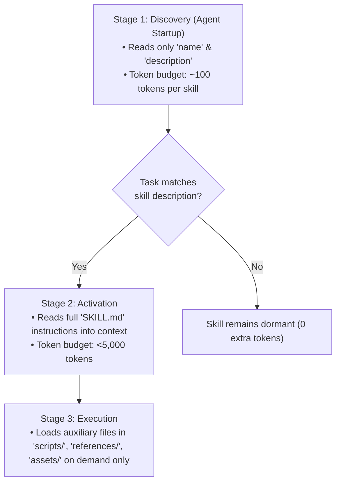

# In-Depth Comparative Specification Analysis

This document provides a deep, rigorous technical examination of the three external specifications under study:
1. **[Agent Skills Specification](#1-agent-skills-specification-agentskills)** (`agentskills` by Anthropic)
2. **[Agent Plugins Specification](#2-agent-plugins-specification-agent-plugins-spec)** (`agent-plugins-spec` v1.0 & v1.1)
3. **[Google Open Knowledge Format](#3-google-open-knowledge-format-knowledge-catalogokf)** (`knowledge-catalog/okf` v0.2 by Google Cloud)

---

## 1. Agent Skills Specification (`agentskills`)

### 1.1 Core Mission & Abstraction
The **Agent Skills** standard is designed to package reusable procedural capabilities, domain expertise, and operational workflows into portable folders that AI agents load on demand.

```text
my-skill/
├── SKILL.md          # Required: YAML frontmatter + procedural instructions
├── scripts/          # Optional: executable code (Python, Bash, JS)
├── references/       # Optional: focused documentation & domain specs
└── assets/           # Optional: templates, lookup tables, schemas
```

### 1.2 Progressive Disclosure Model
The defining architectural strength of Agent Skills is its **3-stage progressive disclosure routine**, optimizing agent token budgets:



1. **Discovery Stage (~100 tokens)**: At startup, agents load only the `name` and `description` frontmatter fields across all installed skills, sufficient to know when a skill is relevant without bloating context.
2. **Activation Stage (<5,000 tokens)**: When a user prompt matches a skill's activation triggers, the agent reads the full `SKILL.md` body prose.
3. **Execution Stage (On demand)**: The agent runs bundled code in `scripts/` or reads individual files in `references/` or `assets/` only when strictly required.

### 1.3 Frontmatter Contract & Validation
The `SKILL.md` frontmatter schema is minimal and focused:

```yaml
---
name: pdf-processing
description: Extracts text and tables from PDF files, fills PDF forms, and merges multiple PDFs. Use when working with PDF documents or when the user mentions PDFs, forms, or document extraction.
license: Apache-2.0
compatibility: Requires Python 3.10+, pdfplumber, and poppler-utils
allowed-tools: Bash(pdfplumber:*) Read
metadata:
  author: data-team
  version: "1.0"
---
```

- **Naming Rules**: 1–64 characters, lowercase alphanumeric (`a-z`, `0-9`) and single hyphens (`-`). Must strictly match the parent directory name.
- **Description Rules**: 1–1024 characters. Must explicitly describe both *what the skill does* and *when to use it* to ensure reliable LLM triggering.
- **Allowed Tools (Experimental)**: Space-separated pre-approved tool tokens (e.g. `Bash(git:*) Read`).

### 1.4 Reference Tooling: `skills-ref`
The specification is accompanied by a formal Python reference package (`skills-ref`) providing:
- **Linter & Validator**: `skills-ref validate ./my-skill` verifying naming constraints, frontmatter types, and line limits.
- **Prompt Testing**: `skills-ref test-prompt` verifying that an agent correctly activates the skill when presented with sample user intents.
- **Evaluation Framework**: Methodology for benchmarking skill effectiveness and refusal guardrails.

---

## 2. Agent Plugins Specification (`agent-plugins-spec`)

### 2.1 Core Mission & Abstraction
The **Agent Plugins** specification (v1.0 published, v1.1 working draft) establishes a vendor-neutral standard for packaging reusable agent capabilities into distributable directory units containing **Skills** and **Model Context Protocol (MCP) servers**.

```text
my-plugin/
├── plugin.json               # Required: portable package manifest
├── skills/                   # Discovered Agent Skills
│   └── summarize/
│       └── SKILL.md
├── mcp.json                  # MCP servers configuration
├── com.example.client/       # Client-specific extension directory
│   └── hooks/
└── LICENSE
```

### 2.2 Strict Package Containment & Security Sandboxing
A cornerstone of Agent Plugins is **filesystem containment**:
- All discovered components, scripts, and configuration paths MUST resolve within the filesystem-resolved plugin root.
- Symlinks or relative paths escaping the plugin root (e.g. `../outside/server`) MUST be rejected immediately by conformant clients.
- Clients enforce narrow failure boundaries: if one MCP server or skill fails containment, only that entry is skipped; the rest of the plugin continues loading.

### 2.3 Closed Manifest Model (`plugin.json`)
The `plugin.json` manifest uses a closed schema to enforce strict validation and typo prevention:

```json
{
  "$schema": "https://agent-plugins.org/schemas/1.1.0/plugin.schema.json",
  "name": "data-tools",
  "version": "1.2.0",
  "description": "Database query and validation tools",
  "author": {
    "name": "Platform Team",
    "email": "platform@example.com"
  },
  "license": "MIT",
  "keywords": ["database", "postgres", "mcp"],
  "extensions": {
    "com.company.agent": {
      "auto_approve": true
    }
  }
}
```

- **Reverse-Domain Extensions**: Client-specific metadata is strictly isolated under reverse-domain keys in `extensions` (e.g. `com.company.agent`), preventing proprietary keys from polluting the portable schema.
- **Version Parity**: Manifest schema and MCP configuration schema versions share the specification version (`1.1.0`).

### 2.4 MCP Server Configuration (`mcp.json`)
The specification standardizes discovery and configuration for MCP servers across stdio and remote transports:

```json
{
  "$schema": "https://agent-plugins.org/schemas/1.1.0/mcp.schema.json",
  "mcpServers": {
    "local-db": {
      "type": "stdio",
      "command": "./bin/db-bridge",
      "args": ["--config", "${PLUGIN_ROOT}/config.json"],
      "cwd": "${PLUGIN_ROOT}",
      "env": {
        "DB_DATA": "${PLUGIN_DATA}/storage"
      }
    },
    "remote-analytics": {
      "type": "streamable-http",
      "url": "https://analytics.example.com/mcp",
      "headers": {
        "X-Tenant": "production"
      }
    }
  }
}
```

- **Environment & Variable Expansion**: Standardizes `${PLUGIN_ROOT}` (read-only package root) and `${PLUGIN_DATA}` (persistent, client-managed writable directory preserved across plugin updates).
- **Transport Types**: `stdio`, `streamable-http`, and deprecated `sse`.
- **Fault-Tolerant Loading**: If an individual MCP server fails to start, the client skips that server and continues loading other servers and skills.

---

## 3. Google Open Knowledge Format (`knowledge-catalog/okf`)

### 3.1 Core Mission & Abstraction
The **Open Knowledge Format (OKF)** (v0.2), created by Google Cloud / Dataplex, represents knowledge and metadata as a directory tree of plain Markdown files with YAML frontmatter.

OKF addresses the challenge of **agent-maintained knowledge corpora**, where most documentation is synthesized or maintained by autonomous agents and crawlers rather than manually written once.

```text
my-knowledge-bundle/
├── index.md                      # Directory listing for progressive disclosure
├── log.md                        # Chronological update history
├── tables/
│   ├── index.md
│   ├── orders.md                 # Concept document
│   └── customers.md
├── computations/
│   └── revenue.md                # Attested Computation concept
└── references/
    └── attesters/
        └── sql-check.py          # Deterministic attestation code
```

### 3.2 Multi-Author Provenance & Actor Conventions
OKF separates **who authored** a concept from **who verified** it:

```yaml
generated: { by: reference_agent/gemini-2.5-pro, at: 2026-06-20T22:53:05Z }
verified:
  - { by: process:nightly-schema-sync, at: 2026-06-21T02:00:00Z }
  - { by: human:ahormati, at: 2026-06-25T09:00:00Z }
```

- **Standardized Actor Syntax**:
  - Agents/Models: `<producer>/<version>` (e.g. `reference_agent/gemini-2.5-pro`, `antigravity/gemini-3.7-flash`).
  - People: `human:<id>` (e.g. `human:alice`, `human:ahormati`).
  - Automated Processes: `process:<id>` (e.g. `process:ci-linter`, `process:nightly-sync`).

### 3.3 Dynamic Trust Tiers
OKF derives trust automatically from the `verified` history:

```mermaid
stateDiagram-v2
    [*] --> Unverified: Doc created without verification
    Unverified --> MachineConfirmed: Verified by process: or agent/
    Unverified --> HumanReviewed: Verified by human:
    MachineConfirmed --> HumanReviewed: Verified by human:
    HumanReviewed --> Stale: now >= stale_after
```

| Trust Tier | Verification State | Consumer Guidance |
| :--- | :--- | :--- |
| **Unverified** | No `verified` block present. | Advisory/draft knowledge; treat with caution. |
| **Machine-Confirmed** | Verified only by `process:` or agent actors. | Validated against schemas/linters; reliable for automated workflows. |
| **Human-Reviewed** | Verified by at least one `human:<id>` actor. | Highest confidence; authoritative sign-off. |

### 3.4 Temporal Freshness Gate (`stale_after`)
OKF introduces an absolute instant for deterministic expiration:

```yaml
stale_after: 2026-12-31T00:00:00Z
```

- Absolute UTC instant (not a relative TTL), making freshness evaluation a deterministic comparison (`now >= stale_after`).
- Prevents agents and humans from relying on outdated assumptions or obsolete schemas.

### 3.5 Structured Source Citations & Footnote Joins
OKF enables granular claim attribution by pairing frontmatter `sources` with Markdown body footnotes:

```markdown
---
sources:
  - id: ga4-spec
    resource: https://developers.google.com/analytics/bigquery/export-schema
    title: GA4 BigQuery Export Specification
    author: team:analytics
    usage_count: 8500
    last_modified: 2026-05-30T00:00:00Z
usage_window: { from: 2026-05-01T00:00:00Z, to: 2026-05-31T00:00:00Z }
---

The `events_` table is sharded daily as `events_YYYYMMDD`.[^ga4-spec]

[^ga4-spec]: GA4 BigQuery Export Specification
```

- **Objective Credibility Signals**: `author` (authority), `usage_count` (adoption/exercise frequency), and `last_modified` (recency).
- **Stable ID Joins**: Footnote labels (`[^ga4-spec]`) match `sources[].id`, preventing misattribution when agents reorder frontmatter lists.

### 3.6 Attested Computations
OKF formalizes verifiable, deterministic computations to prevent LLM hallucinations in critical metrics:

```markdown
---
type: Attested Computation
title: Recognized Revenue
status: stable
runtime: bigquery
parameters:
  - { name: year, type: integer, required: true }
executor:
  resource: references/skills/run-on-bq.md
  receipt: [job_id, executed_sql, result]
attester:
  resource: references/attesters/sql-equality.py
---

# Computation

    SELECT SUM(amount) AS revenue
    FROM finance.recognized_revenue
    WHERE fiscal_year = @year
```

- The agent supplies only typed parameter values (`year: 2026`).
- The consumer executes the query and passes the execution `receipt` (`job_id`, `executed_sql`) to the deterministic `attester` code.
- Verifies that the blessed query ran, rather than an improvised agent-authored query.

### 3.7 Interactive Standalone HTML Visualizer (`viz.html`)
OKF bundles a Python CLI command (`reference_agent visualize --bundle ./bundles/my_bundle`) that compiles the entire bundle into a **self-contained, zero-dependency HTML file** (`viz.html`):
- Uses [Cytoscape.js](https://js.cytoscape.org/) for interactive force-directed graph rendering.
- Embedded full-text search across titles, concept IDs, and tags.
- Dynamic "Cited By" backlink calculation and interactive link rewriting.
- Runs offline in any browser; easily attached as a CI build artifact.

### 3.8 Two-Pass Reference Agent Pipeline
The OKF repository provides a proof-of-concept autonomous ingestion agent:
1. **Source Pass (Structured Ingestion)**: Queries BigQuery schemas, tables, and views to generate initial concept markdown files.
2. **Web Crawler Pass (Autonomous Enrichment)**: LLM crawls seed documentation URLs, evaluates outbound links, and autonomously enriches existing concept docs or mints reference concepts.

---

## 4. Synthesis: How ODS Compares and What is Missing

```mermaid
graph LR
    subgraph ODSCurrent ["Current ODS Strengths"]
        O1["Git-Native Markdown-First"]
        O2["Strict 3-Tier Layering"]
        O3["Verifiable DAG Engine (depends)"]
        O4["Symbol Code Bindings (no :L45)"]
        O5["Bounded AI Context Algorithm"]
    end

    subgraph MissingCapabilities ["Gaps Identified from Comparative Audit"]
        G1["Lack of Multi-Author Provenance (generated vs verified)"]
        G2["No Deterministic Freshness Gate (stale_after)"]
        G3["Lack of Footnote Claim Joining (sources)"]
        G4["No Executable/Attested SOP Runbooks"]
        G5["No Zero-Install Interactive DAG Visualizer"]
        G6["Lack of Strict Filesystem Containment Rules"]
        G7["Lack of Official MCP Server Runtime"]
    end

    ODSCurrent -.-> MissingCapabilities
```



### Gap Analysis Summary:

1. **Provenance & Trust**: ODS's `owner` and `created`/`updated` represent static ownership. It cannot distinguish between human-authored, agent-generated, and CI-verified documentation. Adopting Google OKF's `generated`, `verified`, Actor conventions, and Trust Tiers solves this.
2. **Freshness & Staleness**: ODS's `ods.status: [draft, stable, deprecated, archived]` requires manual status flips. Adding `stale_after` allows automated CI linters to catch decaying documentation.
3. **Traceability**: ODS has `ods.resources` for local files. Adopting OKF's `sources` with objective credibility signals and footnote joins provides verified external lineage.
4. **Interactive Exploration**: ODS CLI outputs DOT/Mermaid graphs, which requires external graph rendering tools. Adopting OKF's single-file Cytoscape `viz.html` model via `ods viz` creates an immediate visual delight for developers and stakeholders.
5. **Security Containment**: Learning from Agent Plugins, ODS should mandate strict workspace root containment across all path-resolving keys (`depends`, `resources`, `code`, `context.load`).
6. **Agent Tooling**: ODS should provide an official `ods-mcp` server so any agent can natively query `ods context` and `ods lint`.
