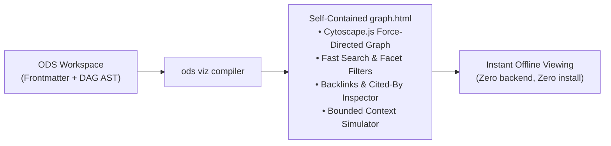

# ODS Enhancements: What, Why, and How

This document specifies the concrete normative proposals, metadata extensions, JSON Schema additions, and CLI capabilities recommended to elevate **Open Document Spec (ODS)** to the next generation of reliability, provenance, and agent compatibility.

---

## 1. Multi-Author Provenance & Actor Attribution

### 1.1 What is changing?
Introduce two optional frontmatter keys:
- **`generated`**: Records how the current document content was authored (`by` and `at`).
- **`verified`**: A list of verification events (`by` and `at`) recording who or what confirmed the content.

```yaml
---
description: Database connection pooling and replica routing policy.
tags: [database, postgres, architecture]
owner: team:data-platform
generated: { by: antigravity/gemini-3.7-flash, at: 2026-08-20T14:30:00Z }
verified:
  - { by: process:ci-sql-linter, at: 2026-08-21T02:00:00Z }
  - { by: human:sarah-lead, at: 2026-08-22T09:15:00Z }
ods:
  profile: architecture
  status: stable
---
```

### 1.2 Why is this necessary?
In modern engineering teams, documentation is increasingly authored by AI coding agents, extracted by automated scripts, or synchronized from schemas. 
- Static `owner: team:platform` indicates team accountability, but does **not** indicate whether an AI agent generated the text, whether CI verified it, or whether a human tech lead performed a peer review.
- Separating `generated` (who wrote it) from `verified` (who signed off) allows agents and developers to immediately assess content trustworthiness.

### 1.3 How to implement it?
1. **Actor Syntax Convention**:
   - AI Agents / Tools: `<agent-name>/<model-or-version>` (e.g. `antigravity/gemini-3.7-flash`, `claude-code/claude-3.7-sonnet`).
   - Humans: `human:<github-handle-or-email>` (e.g. `human:sarah-lead`, `human:alex@company.com`).
   - Automated Processes: `process:<pipeline-id>` (e.g. `process:ci-schema-validator`, `process:nightly-sync`).
2. **Trust Tier Derivation Algorithm**:
   Tooling (`ods lint`, `ods context`, `ods overview`) automatically infers the document's Trust Tier:
   - **Tier 1 (Unverified)**: No `verified` entry present.
   - **Tier 2 (Machine-Confirmed)**: Verified by `process:` or agent actors only.
   - **Tier 3 (Human-Reviewed)**: Verified by at least one `human:` actor.
3. **Plural & Bare Mapping Tolerance**:
   Parsers MUST accept a single verification mapping as a one-element list (`verified: { by: human:sarah, at: 2026-08-22T09:15:00Z }`).

---

## 2. Deterministic Freshness Gate (`stale_after`)

### 2.1 What is changing?
Introduce an optional `stale_after: <ISO-8601-UTC-instant>` frontmatter field:

```yaml
---
description: Quarterly incident response drill procedures and failover checklists.
tags: [incident, sre, oncall]
owner: team:sre
stale_after: 2026-11-30T00:00:00Z
ods:
  profile: sop
  status: stable
---
```

### 2.2 Why is this necessary?
- Documentation silently decays over time. A document marked `status: stable` may describe an architecture or credentials that expired six months ago.
- Static lifecycle statuses (`draft`, `stable`) require manual intervention to flip.
- An absolute UTC instant (`stale_after`) enables **mechanical, deterministic staleness evaluation** without subjective judgement.

### 2.3 How to implement it?
1. **Linting Rule (`STALE-001`)**:
   - When `current_time >= stale_after`:
     - `ods lint` emits a `STALE-001` diagnostic warning.
     - In strict mode (`ods lint --strict-staleness`), it elevates to an error (exit code 1).
2. **Agent Context Annotation**:
   - When `ods context <id>` compiles an agent prompt bundle, if a document is past its `stale_after` timestamp, the context generator prefixes the document with an explicit alert:
     ```text
     [WARNING: DOCUMENT EXPIRED]
     This document reached its stale_after date on 2026-11-30T00:00:00Z. Verify facts against live codebase.
     ```

---

## 3. Structured Sources & Footnote Claim Citations

### 3.1 What is changing?
Introduce structured `sources` array with optional credibility signals, joined to Markdown body claims via footnotes:

```markdown
---
description: OpenID Connect token verification and session management policy.
tags: [auth, security, oidc]
owner: team:security
sources:
  - id: rfc-6749
    resource: https://datatracker.ietf.org/doc/html/rfc6749
    title: The OAuth 2.0 Authorization Framework
    author: process:ietf
    last_modified: 2012-10-01T00:00:00Z
  - id: auth0-guidelines
    resource: https://auth0.com/docs/secure/tokens/access-tokens
    title: Auth0 Access Token Best Practices
    usage_count: 12400
usage_window: { from: 2026-01-01T00:00:00Z, to: 2026-06-30T00:00:00Z }
ods:
  profile: policy
  status: stable
---

# Token Verification Policy

Access tokens MUST use asymmetric RS256 signing keys.[^rfc-6749] Token expiration thresholds MUST NOT exceed 3600 seconds.[^auth0-guidelines]

[^rfc-6749]: The OAuth 2.0 Authorization Framework
[^auth0-guidelines]: Auth0 Access Token Best Practices
```

### 3.2 Why is this necessary?
- `ods.resources` tracks local file attachments on disk, but does not provide structured metadata for external standards, RFCs, regulatory mandates, or URLs.
- Joining structured sources to body claims via footnote identifiers (`[^rfc-6749]`) gives AI agents and human auditors traceable provenance for every normative assertion.
- Credibility signals (`author`, `usage_count`, `last_modified`) provide objective liveness and authority signals without arbitrary, subjective quality scores.

### 3.3 How to implement it?
1. **Frontmatter Schema**:
   - `sources`: Array of objects containing required `resource` (URL or path) and optional `id`, `title`, `author`, `usage_count`, and `last_modified`.
   - `usage_window`: Sibling mapping with `{ from, to }` defining the observation window for usage metrics.
2. **Lint Validation (`GRAPH-005`)**:
   - `ods lint` verifies that every footnote join in the Markdown body (`[^<id>]`) resolves to a matching `sources[].id`.
   - Dangling footnote references emit a `GRAPH-005` warning.

---

## 4. Attested Documentation & Executable SOPs / Runbooks

### 4.1 What is changing?
Enable verifiable operational execution contracts for `profile: sop`, `profile: skill`, and computation recipes:

```markdown
---
description: Monthly customer invoice reconciliation query.
tags: [billing, finance, reconciliation]
owner: team:finance
ods:
  profile: sop
  status: stable
  execution:
    runtime: postgres
    parameters:
      - { name: billing_month, type: string, required: true }
      - { name: account_id, type: integer, required: false }
    executor:
      resource: scripts/run-reconcile.sh
      receipt: [job_id, executed_sql, row_count, result_sha256]
    attester:
      resource: scripts/verify-reconcile.py
---

# Monthly Reconciliation SOP

## Overview
Reconciles Stripe gateway receipts against internal ledger balances.

## Computation

```sql
SELECT account_id, SUM(amount_cents) AS total_revenue
FROM billing_transactions
WHERE billing_period = :billing_month
GROUP BY account_id;
```

## Steps
1. Execute the sanctioned computation above via `executor`.
2. Inspect the returned `receipt`.
3. Run the deterministic `attester` to verify row counts and cryptographic checksums.
```

### 4.2 Why is this necessary?
- Standard documentation allows AI agents to improvise commands or hallucinate SQL queries.
- Attested execution contracts provide a **sanctioned, mechanically verifiable interface**: the agent may only supply parameters; the runner executes the sanctioned code and verifies the receipt.

---

## 5. Interactive Standalone Graph Visualizer (`ods viz`)

### 5.1 What is changing?
Add a native CLI command:
```bash
ods viz --out docs/graph.html --open
```

This compiles the entire ODS workspace into a **single, self-contained interactive HTML file** (`graph.html`).



### 5.2 Why is this necessary?
- Visual exploration accelerates team onboarding and architectural understanding.
- Existing CLI output (`ods graph --format dot`) requires external Graphviz tools and lacks interactivity.
- A single-file HTML visualizer can be shared as a PR artifact, committed to repositories, or hosted on GitHub Pages with zero server infrastructure.

### 5.3 How to implement it?
1. **Architecture**:
   - Embed workspace graph AST and document metadata as a serialized JSON blob in a standalone HTML template.
   - Bundle [Cytoscape.js](https://js.cytoscape.org/) and Markdown renderers (inlined or CDN-backed).
2. **Interactive Capabilities**:
   - **Force-Directed DAG**: Color-coded nodes by profile (`guide`, `decision`, `feature`, `sop`, `agent`).
   - **Directed Edge Visuals**: Solid arrows for `ods.depends` (hard prerequisites); dashed arrows for `ods.related`.
   - **Dynamic Backlink Inspection**: Lists all inbound documents depending on or referencing the selected node.
   - **Context Simulation**: Interactive slider to adjust `max-depth` and simulate exact `ods context` prompt assembly in real time.

---

## 6. Security Containment & Strict Path Sandboxing

### 6.1 What is changing?
Formalize strict filesystem containment requirements across all path-valued keys (`ods.depends`, `ods.related`, `ods.resources`, `ods.code`, `ods.context.load`):

```text
VALID:   ods.depends: [../auth/sessions.md]       (Resolves within repo root)
INVALID: ods.depends: [../../../../etc/passwd]     (Escapes repo root -> REJECT)
```

### 6.2 Why is this necessary?
- When AI coding agents autonomously traverse dependency trees and load context files into prompt payloads, path traversal vulnerabilities could leak sensitive files from the host system.
- Enforcing strict root containment guarantees security and deterministic reproducibility across development machines and CI runners.

### 6.3 How to implement it?
1. **Normative Rule (`CONTAIN-001`)**:
   - All filesystem-resolved paths declared in frontmatter MUST remain strictly within the canonical filesystem root of the workspace.
   - Symlinks or relative paths (`../`) resolving outside the workspace boundary MUST trigger a fatal `CONTAIN-001` error.

---

## 7. Machine-Readable Schema Diffs (`document.schema.json`)

The following JSON Schema Draft 2020-12 diff updates [`schemas/1.0.0/document.schema.json`](../../schemas/1.0.0/document.schema.json) to incorporate the new provenance, trust, freshness, and sources capabilities:

```json
{
  "properties": {
    "generated": {
      "type": "object",
      "description": "How the document was authored or synthesized.",
      "required": ["by"],
      "properties": {
        "by": {
          "type": "string",
          "description": "Actor identifier: <agent>/<version>, human:<id>, or process:<id>."
        },
        "at": {
          "type": "string",
          "format": "date-time",
          "description": "ISO-8601 UTC timestamp of document creation/generation."
        }
      },
      "additionalProperties": false
    },
    "verified": {
      "description": "Verification sign-offs confirming document accuracy.",
      "oneOf": [
        { "$ref": "#/$defs/verification_event" },
        {
          "type": "array",
          "items": { "$ref": "#/$defs/verification_event" }
        }
      ]
    },
    "stale_after": {
      "type": "string",
      "format": "date-time",
      "description": "Absolute ISO-8601 UTC instant on or after which content is considered stale."
    },
    "sources": {
      "type": "array",
      "description": "Materials and standards the document derives from.",
      "items": {
        "type": "object",
        "required": ["resource"],
        "properties": {
          "id": { "type": "string" },
          "resource": { "type": "string" },
          "title": { "type": "string" },
          "author": { "type": "string" },
          "usage_count": { "type": "integer", "minimum": 0 },
          "last_modified": { "type": "string", "format": "date-time" }
        },
        "additionalProperties": false
      }
    },
    "usage_window": {
      "type": "object",
      "properties": {
        "from": { "type": "string", "format": "date-time" },
        "to": { "type": "string", "format": "date-time" }
      },
      "required": ["from", "to"],
      "additionalProperties": false
    }
  },
  "$defs": {
    "verification_event": {
      "type": "object",
      "required": ["by"],
      "properties": {
        "by": { "type": "string" },
        "at": { "type": "string", "format": "date-time" }
      },
      "additionalProperties": false
    }
  }
}
```

---

## 8. Summary of Enhanced Lint Rules Matrix

The normative lint rules in `specs/validation.md` will expand to include:

| Category | Rule ID | Condition | Severity | Description & Remediation |
| :--- | :--- | :---: | :---: | :--- |
| **Freshness** | `STALE-001` | `now >= stale_after` | **Warning** | Document has expired. Review content and update or extend `stale_after`. |
| **Trust** | `TRUST-001` | `verified[].by` missing actor prefix | **Warning** | Actor should use `human:`, `process:`, or `<agent>/<version>` prefix. |
| **Sources** | `GRAPH-005` | Footnote join `[^id]` not found in `sources` | **Warning** | Footnote label does not match any `sources[].id`. |
| **Security** | `CONTAIN-001`| Path escapes workspace root | **Error** | Resolved path escapes repository boundary. |
