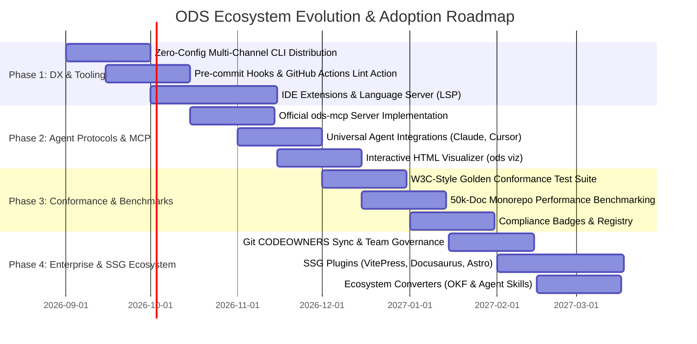

# ODS Reliability & Mass Adoption Roadmap

This document outlines an actionable, 4-phase engineering strategy to make **Open Document Spec (ODS)** exceptionally reliable, developer-friendly, and ready for industry-wide adoption across human engineering teams and autonomous AI agents.



---

## Phase 1: Developer Experience & Frictionless Tooling

For any specification to achieve widespread adoption, the barrier to entry must be virtually zero. Phase 1 focuses on tooling ergonomics and seamless developer workflows.

### 1.1 Multi-Channel CLI Distribution
Eliminate installation friction by making the high-performance Rust CLI (`ods`) accessible through every major package manager:

```bash
# macOS / Linux (Homebrew)
brew install open-doc-spec/tap/ods

# Node.js / JavaScript developers
npx @open-doc-spec/cli lint .

# Rust ecosystem
cargo install ods-cli

# Direct standalone installer script
curl -fsSL https://opendocspec.org/install.sh | bash
```

### 1.2 Automated CI Gates & Pre-Commit Hooks
Provide turn-key GitHub Actions and pre-commit integrations:

```yaml
# .github/workflows/ods-lint.yml
name: Documentation Health Check
on: [push, pull_request]
jobs:
  lint:
    runs-on: ubuntu-latest
    steps:
      - uses: actions/checkout@v4
      - uses: open-doc-spec/action-lint@v1
        with:
          strict-staleness: true
          fail-on-broken-links: true
```

```yaml
# .pre-commit-config.yaml
repos:
  - repo: https://github.com/open-doc-spec/ods
    rev: v0.2.0
    hooks:
      - id: ods-lint
      - id: ods-fmt
```

### 1.3 Language Server Protocol (`ods lsp`) & IDE Extensions
Deploy an official VS Code / Cursor / Zed extension backed by the `ods lsp` daemon:
- **Instant Autocompletion**: Auto-complete `ods.depends` and `ods.related` file paths with real-time fuzzy matching.
- **Section Heading Validation**: Warn in real-time when expected profile headings are missing.
- **Hover Previews**: Hovering over a dependency displays its title, description, and trust tier.
- **Jump-to-Definition**: `Cmd+Click` on `ods.code[].symbol` jumps directly to the source code definition.

---

## Phase 2: Agent Protocols, MCP & Interactive Visualizer

Phase 2 positions ODS as the default documentation and context protocol for autonomous AI agents.

### 2.1 First-Class Model Context Protocol (`ods-mcp`) Server
Ship an official MCP server over `stdio` and `streamable-http`, exposing standard tools to any AI assistant:

```json
{
  "mcpServers": {
    "open-doc-spec": {
      "command": "ods",
      "args": ["mcp", "--workspace", "${workspaceFolder}"]
    }
  }
}
```

#### Exposed MCP Tools:
1. `ods_overview`: High-level pulse of workspace documents, profiles, and compliance status.
2. `ods_find`: Query documents by tag, profile, status, or search term.
3. `ods_get_document`: Retrieve a single document's frontmatter and rendered markdown.
4. `ods_get_context`: Deterministically extract bounded topological prerequisites within a token budget.
5. `ods_lint`: Execute fast workspace diagnostics and report validation errors.

### 2.2 Interactive Single-File HTML Visualizer (`ods viz`)
Implement the `ods viz` compiler (inspired by Google OKF's `viz.html`):
- Generates a standalone, zero-dependency `graph.html` application.
- Integrates Cytoscape.js force-directed DAG visualization.
- Embeds instant client-side full-text search, profile filters, backlink trees, and prompt context simulation.
- Easily uploaded as a GitHub Actions PR artifact or deployed to static hosting.

### 2.3 Universal Agent Environment Contracts
Maintain ready-to-use setup templates for all major AI coding agents:
- Claude Code: `.claude/skills/ods/SKILL.md`
- Cursor: `.cursor/rules/ods.mdc`
- Antigravity: `builtin/skills/ods/SKILL.md`
- Windsurf / Copilot: `AGENTS.md` synchronization via `ods agents sync`.

---

## Phase 3: Conformance Testing & Monorepo Scale Benchmarks

To establish unwavering trust and reliability across mission-critical enterprise environments, Phase 3 hardens the verification engine.

### 3.1 W3C-Style Conformance Test Suite
Establish an exhaustive, standardized test suite (`tests/conformance/`) with over 200+ golden test fixtures:
- **Valid Fixtures**: Every standard profile, complex DAG graphs, valid sources, multi-author verification blocks.
- **Negative Fixtures**: Targeted failure cases for every Rule ID (`SYNTAX-001..002`, `PLACE-001..002`, `GRAPH-001..005`, `ASSET-001..004`, `STALE-001`, `CONTAIN-001`).
- **Binary Compliance Assertion**: Verify that all conformant implementations produce deterministic exit codes (`0` for valid, `1` for invalid).

### 3.2 Monorepo Scalability & Performance Benchmarking
Benchmark and guarantee ODS performance on enterprise codebases containing 50,000+ Markdown documents:
- **Scan Latency**: Complete workspace discovery and frontmatter parsing in `<250ms`.
- **Incremental Reparsing**: Update graph state in `<2ms` upon single-file file-watcher modification.
- **Memory Footprint**: Background daemon RSS memory guaranteed within `<10 MB` soft budget.

### 3.3 Official Compliance Badge & Verification Tool
Provide an embeddable SVG compliance badge for project READMEs:
```markdown
[](https://opendocspec.org)
```

---

## Phase 4: Enterprise Governance, SSG Plugins & Ecosystem Converters

Phase 4 integrates ODS into enterprise team governance and publishing workflows.

### 4.1 Enterprise Team Governance & CODEOWNERS Sync
Synchronize document ownership with Git organization structures:
- `ods governance sync`: Automatically validates that all frontmatter `owner: team:<slug>` entries map to valid teams in GitHub / GitLab.
- Generates or updates `.github/CODEOWNERS` rules to ensure that documentation changes automatically route to the responsible team leads for review.
- Sends automated Slack/GitHub alerts when documents approach their `stale_after` expiration date.

### 4.2 Static Site Generator (SSG) Ecosystem Plugins
Ensure that ODS workspaces render effortlessly in popular documentation portals:
- **VitePress Plugin** (`@open-doc-spec/vitepress`): Auto-generates sidebar trees, backlink panels, and graph visualizations from ODS frontmatter.
- **Docusaurus Plugin** (`docusaurus-plugin-ods`): Automatically wires DAG relationships into Docusaurus doc relations.
- **Astro Starlight Plugin**: Native component support for rendering ODS metadata cards and code bindings.

### 4.3 Multi-Spec Converters & Cross-Ecosystem Bridges
Provide zero-friction migration utilities:
```bash
# Convert Google OKF bundle to ODS workspace
ods migrate --from okf ./okf-bundle --to ./docs

# Export ODS skills to Anthropic Agent Skills directory
ods export --format agentskills --out ./skills

# Ingest OpenAPI / Database DDL into initial ODS feature & API specs
ods extract --from openapi ./api.yaml --out docs/api/
```

---

## 5. Success Metrics & Key Results

| Objective | Key Result Metric | Target |
| :--- | :--- | :---: |
| **Tooling Ergonomics** | CLI binary installation time via `brew`/`npm`/`cargo` | `< 5 seconds` |
| **Lint Performance** | Workspace verification time for 1,000 documents | `< 50 ms` |
| **Agent Ecosystem** | Official support across leading agent IDEs (Claude, Cursor, AGY) | `100% parity` |
| **Enterprise Integrity** | Conformance test suite pass rate across platforms (macOS, Linux, Windows) | `100% pass` |
| **Staleness Elimination**| Monitored repositories with zero un-triaged stale documents | `> 95% compliance` |
