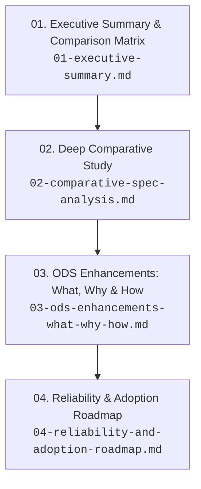

# ODS Specification Study & Ecosystem Evolution Reports

This directory contains a comprehensive, four-part research study and architectural roadmap evaluating **Open Document Spec (ODS)** in comparison with leading industry standards for AI agents and knowledge representation:

1. **[Agent Skills Specification](https://agentskills.io)** (`agentskills` by Anthropic)
2. **[Agent Plugins Specification](https://agent-plugins.org)** (`agent-plugins-spec` v1.0 & v1.1)
3. **[Google Open Knowledge Format](https://github.com/GoogleCloudPlatform/open-knowledge-format)** (`knowledge-catalog/okf` v0.2 by Google Cloud)

---

## 📑 Report Navigation & Reading Guide

| Chapter | Report Document | Focus Area | Key Takeaways |
| :---: | :--- | :--- | :--- |
| **01** | **[Executive Summary](./01-executive-summary.md)** | Strategic synthesis & 4-way comparison matrix | High-level comparison across ODS, Agent Skills, Agent Plugins, and Google OKF; core strategic value of ODS. |
| **02** | **[Comparative Spec Analysis](./02-comparative-spec-analysis.md)** | Deep technical analysis of the 3 external specifications | Progressive disclosure in Agent Skills; packaging, containment & MCP in Agent Plugins; provenance, trust tiers, freshness & Attested Computations in Google OKF. |
| **03** | **[ODS Enhancements (What, Why, How)](./03-ods-enhancements-what-why-how.md)** | Concrete normative and schema improvements for ODS | Detailed specifications for multi-author provenance, actor conventions, trust tiers, `stale_after` expiration, footnote claim joins, `ods viz` interactive visualizer, and strict security sandboxing. |
| **04** | **[Reliability & Adoption Roadmap](./04-reliability-and-adoption-roadmap.md)** | 4-phase execution plan for production readiness | Zero-config CLI/LSP tooling, official `ods-mcp` server, W3C-style conformance test suite, enterprise CODEOWNERS sync, and SSG integrations. |

---

## 🎯 Primary Synthesis & Core Takeaway

Open Document Spec (ODS) possesses a uniquely strong foundation: **Git-native Markdown-first architecture**, **strict 3-tier metadata separation**, **verifiable DAG graph integrity**, and **deterministic bounded AI context loading**.

By synthesizing the best architectural paradigms from:
- **Google OKF**: Transparent multi-author provenance (`generated` vs `verified`), Actor conventions, automated Trust Tiers, deterministic temporal freshness (`stale_after`), structured footnote citations, and zero-install interactive graph visualization (`viz.html`).
- **Agent Skills**: Tiered progressive disclosure and ergonomic capability packaging.
- **Agent Plugins Spec**: Strict filesystem containment sandboxing, non-fatal component fault tolerance, and standardized MCP server runtime interfaces.

ODS can evolve into the universal, enterprise-grade open standard for both human engineering knowledge and autonomous AI agent operations.
