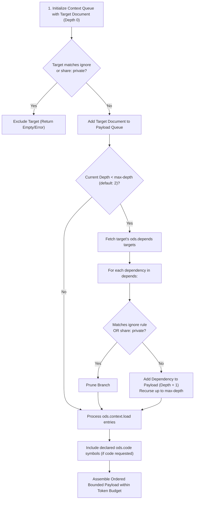

# ODS · Bounded AI Context Scope

This document specifies the **Bounded AI Context** mechanism in Open Document Spec (ODS): deterministic context expansion, lifecycle phase separation, traversal scoping, auxiliary asset loading, conflict analysis, and token budget management.

## At a glance

- **What this chapter defines:** How `ods context` walks `depends`, injects `load`, honors `ignore` / `share`, and optionally includes `code`.
- **Why it exists:** Dumping the repo into a prompt wastes tokens and still misses required prerequisites.
- **When you need it:** You are assembling an agent reading list or implementing the context engine.
- **When you can skip it:** No agent will consume these docs yet.
- **Learn this first:** [Give AI a reading list](../guides/05-ai-reading-list.md)
- **Prerequisite chapters:** [graph.md](graph.md), [keys.md](keys.md)

---

## 1. Conformance Language

The key words **MUST**, **MUST NOT**, **REQUIRED**, **SHALL**, **SHALL NOT**, **SHOULD**, **SHOULD NOT**, **RECOMMENDED**, **NOT RECOMMENDED**, **MAY**, and **OPTIONAL** in this document are to be interpreted as described in BCP 14, exactly as stated in [README.md §1](README.md#1-conformance-language). That is the canonical statement; do not maintain a second copy here.

---

## 2. The 5 Engine Subsystems Seen by Context Resolution

Canonical matrix: [keys.md §4](keys.md#4-subsystem-matrix-of-engine-keys). Context resolution treats the five path-bearing subsystems as follows (`code` is opt-in):

```yaml
---
description: "Checkout API Integration and Execution Guide"
tags: [checkout, payments]
ods:
  profile: guide
  status: stable

  # ─────────────────────────────────────────────────────────────────
  # 1. KNOWLEDGE GRAPH (Structural DAG Prerequisites)
  # • Auto-traversed by 'ods context' up to max-depth (default: 2)
  # • Strict DAG: Cycles are forbidden (checked by 'ods lint')
  # ─────────────────────────────────────────────────────────────────
  depends:
    - ../auth/sessions.md
    - ../billing/payment-gateway.md

  # ─────────────────────────────────────────────────────────────────
  # 2. DISCOVERY GRAPH (Human Associative Links & Typed Domain Edges)
  # • Titles/descriptions only — bodies are never auto-loaded
  # • Cycles allowed (e.g. Doc A related to Doc B, Doc B related to Doc A)
  # ─────────────────────────────────────────────────────────────────
  related:
    - ../marketing/promotions.md

  # ─────────────────────────────────────────────────────────────────
  # 3. ASSET CATALOG (Disk-level Non-Markdown Files & URLs)
  # • Local files verified for disk existence by 'ods lint'; URLs syntax-checked only
  # • NEVER loaded into LLM prompts (protects token limits)
  # ─────────────────────────────────────────────────────────────────
  resources:
    - path: ../diagrams/checkout-flow.pdf      # 15MB binary PDF (do not load into prompt)
    - path: ../schemas/order-payload.json     # Data schema on disk

  # ─────────────────────────────────────────────────────────────────
  # 4. CODE BINDINGS (Implementation & Tests)
  # • Opt-in: included only when the caller asks for code
  # • Not a graph node; path + symbol, never :L45
  # ─────────────────────────────────────────────────────────────────
  code:
    - path: apps/billing/src/refund.ts
      role: implementation
      symbol: processRefund

  # ─────────────────────────────────────────────────────────────────
  # 5. AI PROMPT WINDOW BOUNDS & INCLUSIONS (Surgical Prompt Payload)
  # • Injected directly into the LLM context bundle
  # • Governs recursion bounds and path pruning
  # ─────────────────────────────────────────────────────────────────
  context:
    max-depth: 2                              # Follow 'depends' up to 2 hops deep (range 0-10)
    load:
      - ../schemas/order-payload.json         # Surgically inject JSON schema into prompt
      # NOTE: Do NOT list '../auth/sessions.md' here; it is already auto-loaded via 'depends'!
    ignore:
      - archive/                              # Prune historical documents
      - fixtures/                             # Prune noisy test fixtures
---
```

---

## 3. Subsystem Summary Matrix

Canonical matrix of auto-load and lint behavior per key: [keys.md §4](keys.md#4-subsystem-matrix-of-engine-keys). Do not maintain a second copy here.

What matters for context resolution specifically:

- **`ods.depends`** is the only edge type traversed for **document bodies**, and only up to `max-depth`.
- **`ods.related`** contributes **titles and descriptions only** — a one-line "Related Context Index" so the agent knows what exists without paying for it. Bodies are never pulled in automatically; a caller must ask for them explicitly.
- **`ods.resources`** contributes **nothing** to the payload. It is a disk catalog for humans, verified by lint. This is deliberate: see §5 Q2.
- **`ods.context.load`** is the only key that injects arbitrary file contents.
- **`ods.code`** is opt-in, and contributes sliced symbols rather than whole files.

---

## 4. Lifecycle Phase Separation

ODS clearly decouples the **Authoring/Verification Phase** from the **AI Context Resolution Phase**:

```text
┌─────────────────────────────────────────────────────────────────────────┐
│ PHASE 1: Authoring & Verification Phase (Executed by 'ods lint')         │
│ • Validates that files declared in 'resources' exist on disk            │
│ • Validates that 'depends' paths exist and form an acyclic DAG          │
│ • Validates that 'code' bindings exist and contain no line numbers      │
│ • Zero LLM prompt tokens consumed                                       │
└────────────────────────────────────┬────────────────────────────────────┘
                                     │ Passes with Exit Code 0 (Compliant)
                                     ▼
┌─────────────────────────────────────────────────────────────────────────┐
│ PHASE 2: AI Context Resolution Phase (Executed by 'ods context <id>')   │
│ 1. Start at target document (Depth 0)                                   │
│ 2. Auto-traverse 'depends' up to 'max-depth' hops (default: 2)          │
│ 3. Ingest files explicitly listed in 'context.load' (schemas/fixtures)  │
│ 4. Prune branches matching 'context.ignore' or 'share: private'         │
│ 5. Include declared 'ods.code' symbols (only when code is requested)    │
│ 6. Emit unified bounded prompt payload within the caller's token budget │
└─────────────────────────────────────────────────────────────────────────┘
```

---

## 5. Conflict Analysis & Duplication Rules (FAQ)

### Q1: Do you need to mention `depends` targets in `context.load`?
**No.** `ods context` walks `ods.depends` automatically up to `max-depth`. Declaring dependencies in `depends` is sufficient; duplicating them inside `context.load` is redundant.

```yaml
# RIGHT: Clean separation
ods:
  depends:
    - ../auth/sessions.md         # Auto-walked by context resolution!
  context:
    load:
      - ../schemas/payload.json   # Extra non-document data schema needed by LLM

# WRONG: Redundant duplication
ods:
  depends:
    - ../auth/sessions.md
  context:
    load:
      - ../auth/sessions.md       # REDUNDANT: Already included via 'depends'!
      - ../schemas/payload.json
```

### Q2: Why is a dedicated `context.load` key necessary?
A dedicated `context.load` key solves three fundamental architectural challenges:

#### 1. The Token & Binary Asset Problem (`resources` vs `load`)
`ods.resources` tracks all static assets attached to a document (including 50MB PDFs, high-resolution PNG architecture diagrams, and screen recordings). If `resources` were auto-loaded into an AI context window, binary files would immediately crash LLM context limits or waste tens of thousands of tokens. `context.load` allows authors to surgically select only the lightweight text, JSON schemas, or CSV fixtures the LLM actually needs to read.

#### 2. Knowledge Graph Purity (`depends` vs `load`)
`ods.depends` expresses formal conceptual dependencies between knowledge documents. An AI task often requires auxiliary test data (e.g. a sample mock CSV, a test JSON payload, or an environment template) that is not a conceptual prerequisite document. Overloading `depends` with non-document fixtures would corrupt DAG ordering and topological sorting. `context.load` injects ad-hoc prompt files safely without distorting the knowledge graph.

#### 3. Preventing Context Window Bloat (`related` vs `load`)
`ods.related` links are associative (*"See also..."*). If the engine automatically traversed `related` links, an AI prompt query would trigger an associative explosion across the entire repository. Keeping `related` un-traversed by default, while allowing authors to target specific related documents via `context.load` when strictly necessary, preserves prompt precision.

---

## 6. The Context Resolution Algorithm (Normative)

When `ods context <path-or-id>` is invoked, the engine MUST execute the following deterministic procedure:



### Resolution Steps (ODS 1.1):
1. **Initialize**: Enqueue the entrypoint document $D_0$ at depth $0$.
2. **Privacy & Staleness Guard**:
   - If $D_0$ has `ods.share: private` (in an unprivileged session) or matches workspace `ignore`, abort.
   - If $D_0$ has `stale_after` and $\text{now} \ge \text{stale_after}$, flag as stale or refuse if `--strict-freshness` is enabled.
   - If $D_0$ has `valid_to` and $\text{now} \ge \text{valid_to}$, filter out as superseded historical state unless historical querying is enabled.
3. **Trust Tier Evaluation**:
   - Compute the trust tier for $D_0$ from its `verified` entries. Derivation rules and tier ordering: [keys.md §7.9](keys.md#79-odscontext).
   - If the tier is below `ods.context.trust-min` (or a caller-supplied override), exclude the document and **report the exclusion**. Silent filtering is prohibited: an agent that receives a smaller payload than expected must be able to learn why.
4. **Adaptive Token-Budget Allocation (4-Tier Payload)**:
   - **Tier 1 (50% Budget - Primary Focus)**: Target document $D_0$ body + H2 headings.
   - **Tier 2 (35% Budget - Prerequisites)**: Recurse along `ods.depends` up to `max-depth` (default 2 hops, maximum 10). Frontmatter is stripped to minimize token overhead.
   - **Tier 3 (10% Budget - Asset & Schema Signatures)**: Load `context.load` files and extract signatures/schemas from `ods.resources` and `ods.schema`.
   - **Tier 4 (5% Budget - Discovery Index)**: Scan `ods.related` links and append a 1-line **"Related Context Index"** carrying each target's title and `description` — never its body. This is the whole of `related`'s participation in a payload.
5. **Code Binding Inclusion**:
   - When the caller requests code, parse `ods.code` bindings and slice the exact function, struct, or class named in `symbol` using a language-aware parser. Line numbers are never used. Whole-file inclusion is a fallback only when no `symbol` is declared.
6. **Final Assembly & Topological Formatting**:
   - Format the aggregated payload in topological order (deepest prerequisites first, entrypoint last) within the caller's token budget.
   - Emit deterministic, ordered, token-bounded context payload with provenance footnotes and trust tier headers.

---

## 7. Concrete End-to-End Walkthrough

### Document Frontmatter (`features/billing/refunds.md`):
```markdown
---
description: Customer credit card refund processing workflow.
tags: [billing, refunds]
ods:
  profile: guide
  status: stable
  share: public

  # Structural prerequisite (Walked automatically up to max-depth = 2)
  depends:
    - ../../auth/sessions.md
    - ../../crypto/tokens.md

  # Soft reference (title + description only; body not loaded)
  related:
    - ../../policy/refund-sla.md

  # Asset catalog (Verified on disk; NOT loaded into prompt)
  resources:
    - path: ../../diagrams/refund-flow.pdf

  # AI prompt window configuration
  context:
    max-depth: 2
    load:
      - ../../schemas/refund-request.json   # Injected directly into LLM prompt
    ignore:
      - archive/

  # Implementation code bindings
  code:
    - path: apps/billing/src/refund.ts
      role: entrypoint
      symbol: processRefund
---

# Refund Processing Guide
```

### Resulting Context Output (entrypoint `features/billing/refunds.md`, budget 4,000 tokens):
1. `crypto/tokens.md` (Transitive prerequisite at Depth 2)
2. `auth/sessions.md` (Direct prerequisite at Depth 1)
3. `schemas/refund-request.json` (Auxiliary schema via `context.load`)
4. `apps/billing/src/refund.ts` (Entrypoint implementation via `ods.code`)
5. `features/billing/refunds.md` (Primary entrypoint document)

Total Tokens: ~2,850 tokens (comfortably within the 4,000 token budget; zero binary asset overhead).

---

## 8. Design Decisions

### Why not rely solely on vector embeddings / semantic RAG?
Semantic RAG retrieves arbitrary fragments based on keyword similarity, frequently pulling in deprecated code snippets or omitting foundational architectural prerequisites that do not contain the query terms. Graph-driven bounded context is deterministic, reproducible, and complete.

### Why default `max-depth` to 2 hops?
Empirical testing in engineering repositories demonstrates that 2 hops along `depends` captures ~95% of required architectural context while preventing exponential graph expansion from overwhelming LLM prompt token limits.

---

## Navigation & Reading Order

| [← Previous Chapter](graph.md) | [📑 Specification Index](README.md) | [Next Chapter →](assets.md) |
| :--- | :---: | ---: |
| **05. Document Graph & Identity** | **Open Document Spec (ODS)** | **07. Assets & Code Bindings** |
