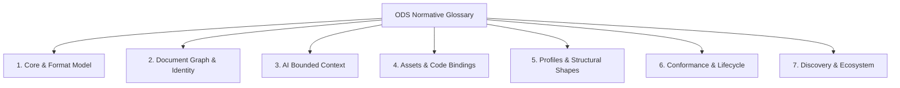
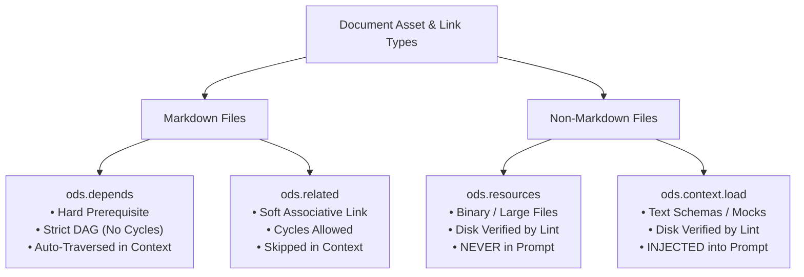

# ODS · Terminology & Comprehensive Glossary

This document is the authoritative **Normative Terminology Reference** for Open Document Spec (ODS). It provides rigorous, unambiguous definitions for the core concepts across the 7 specification domains, details frequently confused distinctions, and cross-references each term to its governing specification chapter.

## At a glance

- **What this chapter defines:** Formal definitions for every core term, grouped by domain.
- **Why it exists:** Chapters should not each reinvent "workspace" or "profile."
- **When you need it:** You hit an unfamiliar term or two chapters seem to disagree.
- **When you can skip it:** Learning the product — terms are introduced in [Learn ODS](../guides/README.md) when first needed.
- **Learn this first:** [Why ODS exists](../guides/00-why-ods.md)
- **Prerequisite chapters:** [README.md](README.md)

---

## 1. Conformance Language

The key words **MUST**, **MUST NOT**, **REQUIRED**, **SHALL**, **SHALL NOT**, **SHOULD**, **SHOULD NOT**, **RECOMMENDED**, **NOT RECOMMENDED**, **MAY**, and **OPTIONAL** in this document are to be interpreted as described in BCP 14, exactly as stated in [README.md §1](README.md#1-conformance-language). That is the canonical statement; do not maintain a second copy here.

---

## 2. Terminology Map by Domain

ODS terminology is organized into 7 functional domains:

---

## 3. Core Architecture & Format Model

| Term | Normative Definition | Chapter Reference |
| :--- | :--- | :--- |
| **Workspace** | A directory tree declared by the presence of a root `ods.toml` manifest containing a `spec` version. The workspace defines the boundary for document discovery, identity resolution, graph traversal, and CI validation. | [Chapter 08 · indexes.md](indexes.md#2-workspace-marker-odstoml) |
| **Document** | Any standard Markdown (`.md`) file located within an ODS workspace. ODS documents maintain 100% Markdown compatibility without requiring proprietary file extensions. Frontmatter is optional. | [Chapter 02 · core.md](core.md#3-format-model) |
| **Frontmatter** | A YAML metadata block delimited by opening and closing `---` markers at the top of a document. Contains machine-readable metadata partitioned strictly into 3 layers. | [Chapter 02 · core.md](core.md#31-frontmatter) |
| **Body Prose** | The human-readable Markdown text following the frontmatter. Contains narrative explanations, workflows, headings, and code snippets. The document's title is declared exclusively by the first `# H1` heading in the body. | [Chapter 02 · core.md](core.md#33-body-prose) |
| **3-Layer Key Placement** | The strict architectural partitioning of metadata into **Layer 1 (Universal & OKF)** top-level keys, **Layer 2 (Engine)** keys scoped under `ods:`, and **Layer 3 (Workspace Boundary)** keys in root `ods.toml`. Canonical membership of each layer is defined in keys.md; Layer 3 is enumerated in indexes.md §3. | [Chapter 03 · keys.md](keys.md#3-the-3-layer-key-placement-architecture) |
| **Bidirectional Aliases** | Pairs of frontmatter keys that are 100% interchangeable and resolve symmetrically in parsers: `created` $\longleftrightarrow$ `created_at`, `updated` $\longleftrightarrow$ `updated_at`. | [Chapter 03 · keys.md](keys.md#64-created--created_at-and-updated--updated_at) |
| **Single Source of Truth (SSOT)** | The core design invariant dictating that every piece of information has exactly one canonical location. Specifically, the document title lives solely in the first `# H1` body header, and prose body text MUST NOT re-declare frontmatter metadata. | [Chapter 02 · core.md](core.md#2-design-principles-priority-order) |
| **Unknown Key Preservation** | The mandatory parser and tooling invariant requiring all third-party and unrecognized YAML frontmatter keys (e.g. Astro `hero_image`, Hugo `layout`, Jekyll `permalink`) to be preserved verbatim during formatting, migration, or refactoring. | [Chapter 09 · validation.md](validation.md#6-unknown-content-behavior-normative) |

| **Minimal Conformant Document** | A UTF-8 Markdown file inside a workspace. Frontmatter is optional and every field within it is optional; errors arise only from keys that are present and wrong. | [Chapter 02 · core.md](core.md#30-minimal-conformant-document) |
| **Dialect** | A workspace-wide interpretation mode declared in `ods.toml` (`standard`, `strict`, `agentic`, `okf-superset`). It changes emphasis and warning severity, never validity. | [Chapter 08 · indexes.md](indexes.md#32-dialects) |
| **Deprecated Key** | A key that still parses with full semantics but emits a `DEPR-*` warning and is scheduled for removal in a future MAJOR release. | [Chapter 10 · scope.md](scope.md#7-deprecations--versioning-policy) |

---

## 4. Document Graph & Identity

| Term | Normative Definition | Chapter Reference |
| :--- | :--- | :--- |
| **Path-Derived Document ID** | The default, deterministic identifier of a document, defined as its workspace-relative file path without the `.md` extension, normalized to lowercase with forward slashes `/` (e.g. `guides/auth.md` → `guides/auth`). | [Chapter 05 · graph.md](graph.md#21-default-path-derived-id) |
| **Explicit Document ID (`ods.id`)** | An optional frontmatter override used primarily during document renaming to preserve existing inbound references without requiring immediate cascading link rewrites. | [Chapter 05 · graph.md](graph.md#22-explicit-override-odsid) |
| **Knowledge Graph (`ods.depends`)** | Explicit, directional frontmatter edges declaring **hard conceptual prerequisites**. Auto-traversed during AI context resolution up to `max-depth`. MUST form a strict Directed Acyclic Graph (DAG). | [Chapter 05 · graph.md](graph.md#3-the-dual-graph-architecture) |
| **Discovery Graph & Relations (`ods.related`)** | Unified frontmatter property declaring **soft associative relationships** for lateral reading and **typed semantic domain graph edges** drawn from a closed predicate vocabulary (`is_a`, `part_of`, `owns`, `governed_by`, `see_also`, and the technical binding verbs). Contributes titles and descriptions — never bodies — to a bounded context payload. | [Chapter 05 · graph.md](graph.md#4-directed-semantic-relations-pareto-8020-odsrelated) |
| **DAG Acyclicity** | The mathematical constraint that `ods.depends` edges MUST NOT contain circular reference loops (e.g. `A → B → C → A`). Enforced deterministically by `ods lint` via topological sorting. | [Chapter 05 · graph.md](graph.md#8-dag-validation--cycle-prevention) |
| **Knowledge Graph Purity** | The rule restricting `ods.depends` strictly to other **Markdown documents**. Non-Markdown fixtures, schemas, and binary assets MUST NOT be placed in `depends`. | [Chapter 05 · graph.md](graph.md#7-knowledge-graph-purity-normative) |

| **Symbolic Handle (`@handle`)** | A reference written as `@Name` or `@file.ext` that resolves by workspace-wide index rather than by relative path: an entity handle to the document declaring that `ods.entity`, a file handle to the uniquely-named file. Collisions are `SYM-002` errors. | [Chapter 05 · graph.md](graph.md#44-symbolic-entity--handle-resolution-handle) |
| **Predicate** | The verb of a typed relation edge, drawn from a closed vocabulary. Domain-specific verbs use `{ predicate: custom, custom_predicate: <verb> }`. | [Chapter 05 · graph.md](graph.md#41-the-complete-predicate-vocabulary) |
| **Auto-Inverse Edge** | The reverse edge (`owned_by`, `has_part`, `governs`) that tooling materializes in the index when the forward edge is declared. Never hand-written. | [Chapter 05 · graph.md](graph.md#42-auto-inverse-edge-materialization) |
| **Memory Tier** | One of five cognitive classifications for a memory node: `episodic`, `semantic`, `procedural`, `state`, `profile`. | [Chapter 05 · graph.md](graph.md#52-the-5-memory-tiers) |
| **Bi-Temporal Validity** | The pairing of `valid_from`/`valid_to` (when a fact was true in the world) with `asserted_at` (when the agent recorded it). The two axes differ whenever an agent learns about a past change after the fact. | [Chapter 05 · graph.md](graph.md#53-bi-temporal-filtering) |

---

## 5. AI Bounded Context Scope

| Term | Normative Definition | Chapter Reference |
| :--- | :--- | :--- |
| **Bounded AI Context** | A deterministic, token-optimized context bundle assembled on demand by the `ods context` engine for LLM prompt windows, eliminating prompt bloat, token exhaustion, and context hallucination. | [Chapter 06 · context.md](context.md#2-the-5-engine-subsystems-seen-by-context-resolution) |
| **Context Expansion Algorithm** | The recursive resolution routine that traverses `ods.depends` edges up to `max-depth`, injects `context.load` text fixtures, and prunes paths matched by `context.ignore`. | [Chapter 06 · context.md](context.md#6-the-context-resolution-algorithm-normative) |
| **Context Max Depth (`context.max-depth`)** | An integer in the range `0`–`10` (default: `2`) specifying the maximum recursion depth for transitive dependency resolution along `ods.depends` edges. | [Chapter 06 · context.md](keys.md#79-odscontext) |
| **Prompt Fixtures (`ods.context.load`)** | An array of relative paths to auxiliary non-Markdown text files (JSON schemas, sample CSVs, mock payloads) that are explicitly injected into the AI prompt window. | [Chapter 06 · context.md](keys.md#79-odscontext) |
| **Context Pruning (`ods.context.ignore`)** | Path prefix patterns excluded from context expansion, used to filter out legacy directories or irrelevant subtrees during prompt assembly. | [Chapter 06 · context.md](keys.md#79-odscontext) |

| **Trust Tier** | A document's verification level, derived from its `verified` entries: `unverified` < `machine-confirmed` < `human-reviewed`. Gated during context resolution by `context.trust-min`. | [Chapter 03 · keys.md](keys.md#79-odscontext) |
| **Invariant** | A boolean domain guardrail expression under `ods.invariants` that an autonomous agent MUST NOT violate. | [Chapter 03 · keys.md](keys.md#714-odsinvariants) |
| **Attested Computation** | A document that is also a verifiable executable unit: a sanctioned query or script plus a parameter schema, execution instructions, and a deterministic attester that confirms the execution receipt. | [Chapter 07 · assets.md](assets.md#9-okf-attested-computation-contracts) |

---

## 6. Assets & Source Code Bindings

| Term | Normative Definition | Chapter Reference |
| :--- | :--- | :--- |
| **Asset Catalog (`ods.resources`)** | An array of attached non-Markdown files or external URLs. Local entries are verified for disk existence; URL entries are syntax-checked only and never fetched. Resources are never auto-loaded into a prompt. | [Chapter 07 · assets.md](assets.md#5-non-markdown-resources-odsresources) |
| **Code Bindings (`ods.code`)** | Structured metadata declarations connecting Markdown documentation to concrete source code files and AST symbols across the repository via string shorthand or detailed objects. | [Chapter 07 · assets.md](assets.md#6-source-code-bindings-odscode) |
| **Code Role (`role`)** | One of the 10 architectural classifications assigned to a code binding: `entrypoint`, `implementation` (default), `interface`, `test`, `fixture`, `schema`, `migration`, `config`, `infrastructure`, or `pipeline`. The set is closed. | [Chapter 07 · assets.md](assets.md#7-the-10-standard-code-roles-reference) |
| **Symbol-Based Binding (`symbol`)** | Linking documentation to specific programming language constructs (functions, structs, classes, interfaces, constants) via single string or list of strings. | [Chapter 07 · assets.md](assets.md#8-why-line-numbers-are-strictly-forbidden) |

| **Conformance Profile** | The slice of this specification a tool implements: **Core**, **Graph**, **Context**, or **Full**. Each is a strict superset of the previous one, and the binary compliance contract is scoped to the declared profile. | [Chapter 09 · validation.md](validation.md#21-implementer-conformance-profiles) |
| **Pack** | A versioned directory or repository of reusable profiles, templates, and skills, registered via `packs` in `ods.toml`. | [Chapter 04 · profiles.md](profiles.md#8-ods-packs-reusable-profile-catalogs) |

---

## 7. Structural Profiles & Taxonomy

| Term | Normative Definition | Chapter Reference |
| :--- | :--- | :--- |
| **Profile (`ods.profile`)** | A structural validation contract that defines the semantic intent of a document and specifies its expected H2 or H3 section headings (`##` or `###`). Profiles are not file extensions or presentation layouts. | [Chapter 04 · profiles.md](profiles.md#2-what-is-a-profile) |
| **13 Standard Profiles** | Built-in profile contracts provided by ODS: `note` (default), `guide`, `feature`, `decision`, `sop`, `api`, `architecture`, `policy`, `meeting`, `faq`, `checklist`, `agent`, and `skill`. | [Chapter 04 · profiles.md](profiles.md#3-standard-profiles-catalog) |
| **Custom Profiles** | Organization-specific or domain-specific structural contracts declared in workspace documents and registered via `ods.toml`. | [Chapter 04 · profiles.md](profiles.md#7-custom-profiles--profile-definition-files) |
| **Heading Aliases (`[aliases]`)** | Workspace-wide synonym mappings configured in `ods.toml` that allow recognized alternate section titles (e.g. `Overview` ↔ `Summary`, `Prerequisites` ↔ `Requirements`) to satisfy profile heading validation. | [Chapter 04 · profiles.md](profiles.md#6-section-heading-alias-matching) |
| **Packs (`packs`)** | Reusable, versioned bundles of custom profiles, templates, and skills shared across repositories and configured in `ods.toml`. | [Chapter 04 · profiles.md](profiles.md#8-ods-packs-reusable-profile-catalogs) |

---

## 8. Conformance, Validation & Lifecycle

| Term | Normative Definition | Chapter Reference |
| :--- | :--- | :--- |
| **Binary Compliance** | The foundational validation contract: an ODS workspace is evaluated as either **Compliant** (`ods lint` exits with code `0`) or **Non-Compliant** (`ods lint` exits with code `1`). There is no ambiguous compliance level ladder. | [Chapter 09 · validation.md](validation.md#2-binary-compliance-contract) |
| **Lint Diagnostics** | Structured compiler messages emitted by `ods lint`, classified into `ERROR` (blocks compliance), `WARN` (advisory non-blocking), and `INFO`. | [Chapter 09 · validation.md](validation.md#7-diagnostic-message-presentation) |
| **Atomic Lifecycle Operations** | The 4 safe workspace mutation operations guaranteed by ODS tooling: `new` (scaffold), `mv` (relocate & cascade links), `archive` (retire), and `rm` (delete & scrub inbound edges). | [Chapter 02 · core.md](core.md#6-atomic-lifecycle-operations) |
| **Document Status (`ods.status`)** | The maturity stage of a document: `draft` (work in progress), `stable` (production-ready), `deprecated` (scheduled for retirement), or `archived` (historical reference). | [Chapter 03 · keys.md](keys.md#72-odsstatus) |
| **Share Boundaries (`ods.share`)** | Visibility classification: `public` (open export), `org` (internal organization), or `private` (confidential; automatically pruned from unprivileged AI contexts). | [Chapter 03 · keys.md](keys.md#74-odsshare) |

---

## 9. Discovery, Workspace & Ecosystem

| Term | Normative Definition | Chapter Reference |
| :--- | :--- | :--- |
| **Progressive Discovery** | The on-demand CLI query workflow (`ods overview` → `ods find` / `ods tag` / `ods ls` → `ods context`) that eliminates the need for hand-maintained, conflict-prone folder index files (`index.ods.md`). | [Chapter 08 · indexes.md](indexes.md#4-progressive-discovery-workflow) |
| **Multi-Dialect Support** | The engine's capability to process a workspace under one of four declared dialects — `standard`, `strict`, `agentic`, or `okf-superset` — through unified graph traversal and validation. The dialect changes emphasis and warning severity, never validity. | [Chapter 08 · indexes.md](indexes.md#32-dialects) |

---

## 10. Domain Modeling & Agent Memory

| Term | Normative Definition | Chapter Reference |
| :--- | :--- | :--- |
| **Dual-Graph** | The bi-layer knowledge representation connecting the high-level semantic Domain Graph with the physical Markdown Lexical Graph. | [Chapter 05 · graph.md](graph.md#3-the-dual-graph-architecture) |
| **Domain Graph** | The typed entity network capturing real-world business classes (`ods.entity`), domain boundaries (`ods.domain`), semantic relations (`is_a`, `owns`, `governed_by`), and invariants. | [Chapter 05 · graph.md](graph.md#3-the-dual-graph-architecture) |
| **Lexical Graph** | The physical workspace hierarchy comprising documents, Markdown AST headings (`# H1` $\rightarrow$ `## H2` $\rightarrow$ `### H3`), code bindings (`ods.code`), and DAG dependencies (`ods.depends`). | [Chapter 05 · graph.md](graph.md#3-the-dual-graph-architecture) |
| **Bi-Temporal Memory** | The dual-clock temporal modeling paradigm tracking when a statement was true in reality (`valid_from` to `valid_to`) separately from when an agent observed it (`asserted_at`). | [Chapter 05 · graph.md](graph.md#5-cognitive-memory--bi-temporal-traversal) |
| **Dreaming** | The asynchronous background cognitive reconciliation process that consolidates episodic interaction traces, resolves state conflicts, prunes decayed facts, and synthesizes living profile documents. | [Chapter 06 · context.md](context.md#4-lifecycle-phase-separation) |
| **Attested Computation** | A verifiable computational contract (`type: Attested Computation`) specifying an executable query/script, parameterized inputs, and an automated deterministic attester verifying execution receipts. | [Chapter 07 · assets.md](assets.md#9-okf-attested-computation-contracts) |
| **Trust Tier** | The 3-tier credibility classification (`unverified`, `machine-confirmed`, `human-reviewed`) computed from source usage signals, verification events, and attestation receipts. | [Chapter 06 · context.md](context.md#6-the-context-resolution-algorithm-normative) |
| **Paid-at-the-door Schema**| A disk-level schema validator referenced by `ods.schema` that strictly validates input and state mutations before agent execution or state persistence. | [Chapter 09 · validation.md](validation.md#4-normative-lint-rules-matrix) |

---

## 11. Frequently Confused Concepts (Disambiguation Guide)

### 10.1 `depends` vs `related` vs `context.load` vs `resources`

| Field | Target Type | Cycle Allowed? | Auto-Loaded in AI Prompt? | Purpose |
| :--- | :--- | :---: | :---: | :--- |
| **`ods.depends`** | Markdown (`.md`) | ❌ NO (DAG) | ✅ YES (up to `max-depth`) | Hard conceptual prerequisite needed to understand current document. |
| **`ods.related`** | Markdown (`.md`) | ✅ YES | ❌ NO (opt-in only) | Soft reference for human discovery and cross-reading. |
| **`ods.context.load`**| Non-Markdown (Text) | N/A | ✅ YES | Auxiliary prompt payload (JSON schema, sample CSV, mock payload). |
| **`ods.resources`** | Non-Markdown (Any) | N/A | ❌ NO | Attached binary asset (diagram, PDF report) verified for disk existence. |

---

### 10.2 `profile` vs `tags` vs `type`

| Concept | Canonical Field | Purpose | Format | Example |
| :--- | :--- | :--- | :--- | :--- |
| **Structural Shape** | `ods.profile` | Defines expected H2 or H3 section headings (`##` or `###`). | Single enum string | `profile: decision` |
| **Search Taxonomy** | `tags` (Top-level) | Categorization for search, filtering, and discovery. | List of lowercase strings | `tags: [auth, security]` |
| **OKF Concept Type** | `type` (Top-level) | First-class Google OKF v0.2 native concept type / profile alias. | Single string | `type: BigQuery Table` |

---

### 10.3 `symbol` vs Line Numbers

| Approach | Example | Stability Across Git Commits | ODS Status |
| :--- | :--- | :---: | :--- |
| **Symbol-Based Binding** | `path: src/auth.ts` `symbol: verifySession` | 🟢 High (persists through surrounding line edits) | ✅ **MANDATORY** |
| **Line Number Reference** | `path: src/auth.ts:L45-L60` | 🔴 Very Low (breaks on next commit or whitespace edit) | ❌ **FORBIDDEN** (`CODE-002`) |

---

## 11. Navigation & Quick Links

| Chapter | Specification Module | Focus Area |
| :---: | :--- | :--- |
| **01** | [**`README.md`**](README.md) | Introduction, 5W1H, Specification Map |
| **02** | [**`core.md`**](core.md) | Format Model, Binary Compliance, Atomic Lifecycle |
| **03** | [**`keys.md`**](keys.md) | Frontmatter Key Dictionary & 3-Tier Placement Rules |
| **04** | [**`profiles.md`**](profiles.md) | Document Profiles, Expected Headings, Custom Profiles |
| **05** | [**`graph.md`**](graph.md) | Document Graph, Path-Derived IDs, DAG Acyclicity |
| **06** | [**`context.md`**](context.md) | AI Bounded Context, Expansion Algorithm, Token Budgets |
| **07** | [**`assets.md`**](assets.md) | Resources, Code Bindings, 8 Standard Code Roles |
| **08** | [**`indexes.md`**](indexes.md) | Workspace Config (`ods.toml`), Progressive Discovery |
| **09** | [**`validation.md`**](validation.md) | Validation Contract, Diagnostic Formats, Lint Rules |
| **10** | [**`scope.md`**](scope.md) | Scope Boundaries, Non-Goals, Architectural Trade-offs |
| **REF**| [**`glossary.md`**](glossary.md) *(Current)* | **Normative Terminology Dictionary & Concept Disambiguation** |
