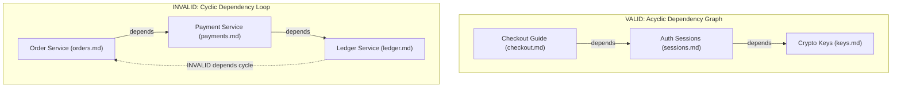

# ODS · Document Graph & Identity

This document specifies the **ODS Document Graph**: document identity, path-derived IDs, single source of truth rules, graph edge types (`depends` / `related`), DAG cycle prevention, and the principle of **Knowledge Graph Purity**.

## At a glance

- **What this chapter defines:** Path-derived IDs, `depends` vs `related`, acyclicity, and document-only purity.
- **Why it exists:** Tools can only lint and walk edges that are explicit and well-typed.
- **When you need it:** You are linking documents, debugging a cycle, or implementing graph validation.
- **When you can skip it:** Isolated documents with no prerequisites — you do not need a graph yet.
- **Learn this first:** [Link documents](../guides/03-link-documents.md)
- **Prerequisite chapters:** [keys.md](keys.md)

---

## 1. Conformance Language

The key words **MUST**, **MUST NOT**, **REQUIRED**, **SHALL**, **SHALL NOT**, **SHOULD**, **SHOULD NOT**, **RECOMMENDED**, **NOT RECOMMENDED**, **MAY**, and **OPTIONAL** in this document are to be interpreted as described in BCP 14, exactly as stated in [README.md §1](README.md#1-conformance-language). That is the canonical statement; do not maintain a second copy here.

---

## 2. Document Identity: IDs are Paths

Every ODS document has a unique identifier within its workspace.

### 2.1 Default: Path-Derived ID
By default, a document's ID **is its workspace-relative file path without the `.md` extension**, normalized using forward slash (`/`) separators:

```text
File Path on Disk                  Workspace Document ID
docs/guides/setup.md           →   docs/guides/setup
features/billing/checkout.md   →   features/billing/checkout
README.md                      →   README
```

- **Deterministic & Zero-Config**: Authors do not need to invent arbitrary UUIDs, database slugs, or hash strings.
- **Normalization**: IDs are case-insensitive. Tools MUST normalize paths to lowercase `a-z`, `0-9`, `-`, `_`, and `/`.
- **Cross-Platform Separators**: Path separators MUST always be normalized to `/` across macOS, Linux, and Windows.

### 2.2 Explicit Override: `ods.id`
An explicit `ods.id` field MAY be set in frontmatter to override the path-derived ID:

```yaml
---
ods:
  # Overrides default path-derived ID for rename stability
  id: architecture/auth-v2
  profile: architecture
  status: stable
---
```

- **When to Use**: Use `ods.id` primarily for **rename stability** when reorganizing heavily referenced legacy documents without immediately cascading link rewrites.
- **Uniqueness**: All document IDs (path-derived or explicit) MUST be unique across the workspace. Duplicate IDs MUST trigger a validation error.

---

## 3. The Dual-Graph Architecture

ODS 1.1 explicitly formalizes and connects two complementary graph topologies across the workspace:

```text
                     ┌────────────────────────────────┐
                     │          DOMAIN GRAPH          │
                     │  (Entities & Conceptual Links) │
                     │   [Customer] --buys--> [Plan]  │
                     └───────────────┬────────────────┘
                                     │
                             grounded_in / cites
                                     │
                     ┌───────────────▼────────────────┐
                     │         LEXICAL GRAPH          │
                     │  (Documents, AST & Embeddings) │
                     │   [Doc.md] -> [H2 Chunk: AST]  │
                     └────────────────────────────────┘
```

1. **Domain Graph**: Captures the real-world business and system semantics:
   - Entities (`ods.entity`, `ods.domain`).
   - Typed semantic relations (`ods.relations`: `is_a`, `part_of`, `owns`, `governed_by`, `maps_to`, `derives_from`).
   - Provenance sources (`sources` / `usage_window`).
2. **Lexical Graph**: Captures the physical documentation AST hierarchy:
   - Hard structural prerequisites (`ods.depends` — strict DAG).
   - Soft lateral discovery references (`ods.related` — cyclic allowed).
   - Non-markdown asset catalogs (`ods.resources`) and source code bindings (`ods.code`).

---

## 4. Directed Semantic Relations (Pareto 80/20: `ods.related`)

To enable rich neuro-symbolic reasoning without syntax overhead, documents declare directed relations using the **Pareto Rule** (`- <predicate>: <target>`) directly under `ods.related`:

> **`ods.relations` is deprecated** (`DEPR-001`, removal targeted at 2.0). It accepts the attributed-object form only and does exactly what `ods.related` already does. Where both are present, `relations` entries are appended to `related` and de-duplicated by `(predicate, target)`. See [scope.md §7.2](scope.md#72-deprecated-in-11--scheduled-for-removal-in-20).

```yaml
ods:
  entity: Customer
  domain: Billing
  related:
    # Bare string (Implicit see_also lateral reference)
    - ../guides/billing-overview.md

    # Pareto Core Single-Key Shorthand
    - is_a: Account
    - owns: [Subscription, Invoice] # Multi-target array & Symbolic Entity resolution
    - part_of: PaymentGateway
    - governed_by: RefundPolicy
    - maps_to: datasets/bq-customers.sql
    - see_also: @faq.md

    # Attributed Relation Object (Only when edge metadata is needed)
    - predicate: manages
      target: @SupportTeam
      role: "Tier 1 Support"
      confidence: 0.98
      since: 2026-01-01
```

### 4.1 The Complete Predicate Vocabulary

The predicate vocabulary is a **closed set**. An unrecognized key in the shorthand form is rejected (`ENUM-006`) — this is what makes the graph mechanically traversable by tools that have never seen your domain.

**The 5 Pareto core verbs** cover the large majority of real edges:

| Predicate | Semantic Meaning | Graph Direction | Auto-Inferred Inverse | Example |
| :--- | :--- | :--- | :--- | :--- |
| `is_a` | Classification / Inheritance / Typing. | Subclass $\rightarrow$ Superclass | `superclass_of` | `- is_a: Account` |
| `part_of` | Structural composition / Modular component. | Child $\rightarrow$ Parent Container | `has_part` | `- part_of: PaymentGateway` |
| `owns` | Domain ownership / Lifecycle containment. | Owner $\rightarrow$ Owned Resource | `owned_by` | `- owns: [Subscription, Invoice]` |
| `governed_by` | Policy, SLA, or compliance rule enforcement. | Entity $\rightarrow$ Governing Policy | `governs` | `- governed_by: RefundPolicy` |
| `see_also` | Lateral discovery / associative reference. | Source $\rightarrow$ Target Reference | `see_also` (Symmetric) | `- see_also: @faq.md` |

**Technical binding verbs** connect the domain graph to code, data, and tests:

| Predicate | Semantic Meaning | Auto-Inferred Inverse | Example |
| :--- | :--- | :--- | :--- |
| `maps_to` | Semantic mapping to a physical table, dataset, or API. | `mapped_from` | `- maps_to: datasets/bq-customers.sql` |
| `derives_from` | Data lineage: this value is computed from that one. | `derives` | `- derives_from: ActiveSubscriptions` |
| `implements` | This document or entity realizes that contract or spec. | `implemented_by` | `- implements: @PaymentProvider` |
| `depends_on` | Non-structural runtime or conceptual dependence. Use `ods.depends` for hard, DAG-checked prerequisites. | `depended_on_by` | `- depends_on: @BillingEngine` |
| `exercises` | This test, scenario, or checklist verifies that capability. | `exercised_by` | `- exercises: @RefundFlow` |

**Accepted aliases.** These are shorthand spellings that normalize to a core verb during indexing. They exist so an author can write the word their domain uses; tools MUST record the canonical predicate, not the alias.

| Alias | Normalizes to |
| :--- | :--- |
| `extends` | `is_a` |
| `contains` | `owns` |
| `policy`, `rule` | `governed_by` |
| `table` | `maps_to` |
| `see` | `see_also` |

**Domain-specific verbs.** ODS does **not** accept arbitrary bare `snake_case` keys — an unknown key is indistinguishable from a typo, and silently absorbing typos is how a graph rots. Use the explicit escape hatch instead:

```yaml
ods:
  related:
    # WRONG: bare custom verb is rejected by the schema (ENUM-006)
    # - reconciles_with: @Ledger

    # RIGHT: explicit custom predicate
    - predicate: custom
      custom_predicate: reconciles_with
      target: "@Ledger"
```

Custom edges are stored and traversed like any other edge, but tools MUST NOT infer an inverse for them.

### 4.2 Auto-Inverse Edge Materialization
Authors ONLY write the natural forward relation. The ODS compiler automatically synthesizes reverse inbound edges in memory during workspace indexing:
- When Document A declares `owns: @DocB`, the graph index automatically records `DocB owned_by DocA`.
- When Document A declares `part_of: @DocB`, the graph index automatically records `DocB has_part DocA`.
- When Document A declares `governed_by: @DocB`, the graph index automatically records `DocB governs DocA`.

### 4.3 Attributed Edge Metadata
When relationships require machine-extracted scores, temporal bounds, or a custom verb, use the expanded object shape. `predicate` and `target` are required; every other field is optional.

| Field | Type | Meaning |
| :--- | :--- | :--- |
| `predicate` | enum | One of the standard predicates above, or `custom`. **Required.** |
| `target` | string | Path, `@` file handle, or entity handle. **Required.** |
| `custom_predicate` | string | The domain verb, when `predicate: custom`. Ignored otherwise. |
| `role` | string | Semantic role or association title (e.g. `role: "Lead Maintainer"`). |
| `confidence` | number `0.0`–`1.0` | Machine-extraction certainty. Absent means asserted by a human. |
| `since` / `until` | ISO 8601 | Temporal activation window for the edge itself. |
| `cardinality` | string | Edge constraint: `1`, `N`, `*`, `0..1`, `1..1`, `0..N`, `1..N`, `0..*`, `1..*`, `*..*`. |
| `description` | string | Free-text note explaining the edge, for human readers. |
| `binding` | string | Physical binding for `maps_to` edges: the column, endpoint, or field the edge resolves to. |

### 4.4 Symbolic Entity & Handle Resolution (`@handle`)
Authors can reference target entities and files directly using **`@` handles** instead of brittle relative paths (`../../billing/entities/subscription.md`):
- **Entity Handles**: `@Subscription` or `Subscription` auto-resolves to the document declaring `ods.entity: Subscription`.
- **File Handles**: `@tokens.md`, `@server.ts`, `@customer.schema.json` auto-resolve to unique files in the workspace.
- **Disambiguated Handles**: `@billing/index.md` disambiguates duplicate basenames using folder prefixes.

### 4.5 Workspace Symbol & Basename Indexing Algorithm
The ODS compiler indexes workspace symbols in two passes during discovery:
1. **Pass 1 (Entity & Basename Discovery)**: Scans all documents and builds memory-mapped lookup tables:
   - `entities: Map<Symbol, FilePath>` mapping PascalCase identifiers (`Subscription` $\rightarrow$ `entities/subscription.md`).
   - `basenames: Map<Basename, Set<FilePath>>` mapping unique file names (`server.ts` $\rightarrow$ `apps/api/src/server.ts`).
2. **Pass 2 (O(1) Resolution & Collision Detection)**:
   - If a handle has exactly one match, it resolves in $\mathcal{O}(1)$ time.
   - If zero matches exist, the linter emits `SYM-001: Unresolved @ handle`.
   - If multiple files share the basename without disambiguation, the linter emits `SYM-002: Ambiguous @ handle`.

---

## 5. Cognitive Memory & Bi-Temporal Traversal

This section is the canonical definition of memory semantics. [keys.md §7.15–7.19](keys.md#715-the-memory-block) gives the per-key type reference and defers here for meaning.

### 5.1 Canonical Placement

Memory fields live in the **top-level `memory:` block**:

```yaml
memory:
  tier: episodic
  valid_from: "2026-08-26T10:00:00Z"
  valid_to: null
  asserted_at: "2026-08-26T10:05:00Z"
  pin: true
  mutations:
    - { entity: Customer, id: cust-4048, property: plan, old_value: starter, new_value: enterprise }
```

`ods.memory:` and the flat `ods.tier` / `ods.valid_from` / `ods.valid_to` / `ods.asserted_at` / `ods.mutations` / `ods.pin` keys are **deprecated** (`DEPR-002`). Parsers MUST still read them. Precedence, when the same field appears more than once: `memory:` > `ods.memory:` > flat `ods.*`. Conflicting values for one field are a `MEM-004` error rather than a silent pick.

### 5.2 The 5 Memory Tiers

| Tier | Holds | Typical lifetime |
| :--- | :--- | :--- |
| `episodic` | Raw time-stamped agent session traces and event logs. | Short; subject to decay pruning unless pinned. |
| `semantic` | Canonical domain knowledge and settled facts. | Long. |
| `procedural` | Operational heuristics and learned workflows. | Long. |
| `state` | The current value of a living entity or user attribute, synthesized across episodes. | Superseded rather than expired. |
| `profile` | A distilled, stable characterization of an actor — preferences, constraints, working style — accumulated from many episodes. | Longest; effectively permanent until contradicted. |

`state` answers "what is true right now"; `profile` answers "what is persistently true about this actor". Keeping them apart lets an engine expire a stale `state` node without discarding the `profile` built from it.

### 5.3 Bi-Temporal Filtering

When traversing agent memory nodes, the graph engine applies bi-temporal filtering:
- **`valid_from` / `valid_to`**: The real-world validity window — when the fact was true *in the world*. Facts where `now >= valid_to` are excluded from active context queries unless an explicit historical timestamp is requested.
- **`asserted_at`**: The instant the recording agent observed the fact — when it became true *in the record*. The two axes differ whenever an agent learns about a past change after the fact.
- **`pin`**: Nodes marked `pin: true` are immune to automated decay and pruning.
- `valid_to: null` means "still true". An absent `valid_to` is equivalent to `null`.
- `valid_to` earlier than `valid_from` is a `MEM-001` error.

---

## 6. Structural Edge Types (`depends` & `related`)

The Lexical Graph standardizes two directional edge types:
- **`ods.depends`**: Strict structural and conceptual prerequisites forming a **strict DAG** (participates in auto-expanded AI context).
- **`ods.related`**: Associative domain and discovery links (discovery graph, cycle-tolerant).

### 6.1 Pareto Prerequisite Verbs for `ods.depends`

```yaml
ods:
  depends:
    # Bare string (Default: Hard prerequisite)
    - @jwt-auth.md

    # Typed Prerequisite Child Verbs
    - requires: @database-setup.md       # Must be read/executed first
    - extends: @base-service-spec.md     # Base architectural specification
    - imports: @common-types.schema.json # Shared contract/type dependency

    # Attributed Dependency Object
    - predicate: requires
      target: @redis-cluster.md
      optional: false
      scope: runtime                     # compile | runtime | test
```

---

## 7. Knowledge Graph Purity (Normative)

A critical principle of ODS is **Knowledge Graph Purity**:

```text
┌─────────────────────────────────────────────────────────────────────────┐
│ PRINCIPLE: KNOWLEDGE GRAPH PURITY                                       │
│ • 'ods.depends' expresses conceptual prerequisites between DOCUMENTS.   │
│ • Non-document fixtures (JSON schemas, sample CSVs, mock payloads) MUST │
│   NOT be placed in 'depends'.                                           │
│ • Why? Non-document files cannot participate in topological sort DAG    │
│   validation. Auxiliary test/prompt data belongs in 'context.load'.     │
└─────────────────────────────────────────────────────────────────────────┘
```

### Commented Comparison:
```yaml
# VALID: Pure Knowledge Graph dependencies + surgical prompt scoping
ods:
  # 1. Conceptual document dependencies (Participate in DAG topological sort)
  depends:
    - ../auth/sessions.md
    - ../crypto/jwt-spec.md

  # 2. Auxiliary prompt payload (Non-document fixtures for AI agent)
  context:
    load:
      - ../schemas/auth-payload.json

# INVALID: Corrupting the Knowledge Graph with non-document fixtures
ods:
  depends:
    - ../auth/sessions.md
    - ../schemas/auth-payload.json    # INVALID: JSON schema is not an ODS document!
```

---

## 8. DAG Validation & Cycle Prevention

The dependency graph formed by `ods.depends` edges MUST be a **Directed Acyclic Graph (DAG)**.



### 8.1 Cycle Detection Algorithm
1. Tooling performs a topological sort or Depth-First Search (DFS) traversal of all `ods.depends` edges across the workspace.
2. If any node path encounters a back-edge to an ancestor node in the active traversal stack, a cycle error is reported (`GRAPH-004`).
3. If two documents are mutually interdependent, one relationship MUST be changed to `ods.related` or refactored into a shared prerequisite document.

---

## 9. Single Source of Truth & Dynamic Backlinks

1. **Title Single Source of Truth**: In pure ODS, the document title exists as the first `# H1` in the prose body. Top-level `title:` is supported for Google OKF v0.2 interoperability.
2. **Relationships Live in Frontmatter**: Machine-readable dependencies live exclusively in `ods.depends` and `ods.related`.
3. **No Hand-Written Backlinks**: Authors MUST declare graph edges only on the dependent document. Inbound backlinks MUST be computed dynamically by tooling (`ods graph --backlinks`) and NEVER hand-maintained in frontmatter.

---

## 10. Design Decisions

### Why separate the Domain Graph from the Lexical Graph?
Document dependencies (`depends` / `related`) model how humans and agents read documents sequentially. Business relationships (`is_a`, `owns`, `maps_to`) model how data and domain entities interact. Separating the two into a **Dual-Graph** provides full neuro-symbolic expressiveness without adding friction to basic document authoring.

### Why forbid hand-written backlinks?
Maintaining bidirectional links manually (e.g. Doc A listing Doc B as child, and Doc B listing Doc A as parent) results in link rot whenever a file is renamed or moved. Computing backlinks on demand in tooling ensures 100% synchronization accuracy.

---

## Navigation & Reading Order

| [← Previous Chapter](profiles.md) | [📑 Specification Index](README.md) | [Next Chapter →](context.md) |
| :--- | :---: | ---: |
| **04. Structural Profiles & Shapes** | **Open Document Spec (ODS)** | **06. Bounded AI Context Scope** |
