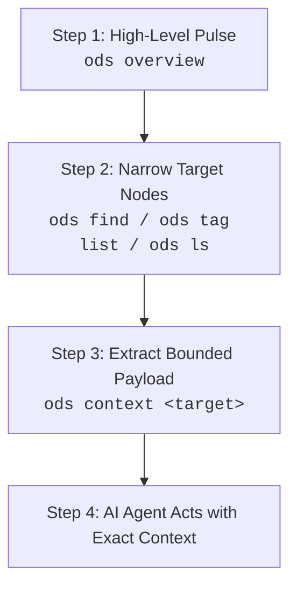

# ODS · Workspace Configuration & Progressive Discovery

This document specifies the **ODS Workspace Configuration** (`ods.toml`), the elimination of committed folder index files, and the **Progressive Discovery** model for human developers and AI agents.

## At a glance

- **What this chapter defines:** Root `ods.toml`, the complete workspace key reference, ignore defaults, and the progressive discovery model.
- **Why it exists:** A workspace needs one boundary file, not committed folder indexes that churn in Git.
- **When you need it:** You are configuring a repo, adding ignore rules, or implementing discovery.
- **When you can skip it:** `spec = "1.1"` is already enough to start — see [Your first document](../guides/01-first-document.md).
- **Learn this first:** [Run the workspace](../guides/06-run-the-workspace.md)
- **Prerequisite chapters:** [keys.md](keys.md)

---

## 1. Conformance Language

The key words **MUST**, **MUST NOT**, **REQUIRED**, **SHALL**, **SHALL NOT**, **SHOULD**, **SHOULD NOT**, **RECOMMENDED**, **NOT RECOMMENDED**, **MAY**, and **OPTIONAL** in this document are to be interpreted as described in BCP 14, exactly as stated in [README.md §1](README.md#1-conformance-language). That is the canonical statement; do not maintain a second copy here.

---

## 2. Workspace Marker: `ods.toml`

An ODS workspace is declared by the presence of a single **`ods.toml`** file at the repository root. Only `spec` is required; every other key has a default.

```toml
# ═════════════════════════════════════════════════════════════════
# ods.toml — Repository root configuration (Workspace Boundary)
# ═════════════════════════════════════════════════════════════════

# Targeted ODS specification version (the only REQUIRED key)
spec = "1.1"

# Optional interpretation mode for the whole workspace
dialect = "standard"

# Directory path prefixes excluded from document scanning and linting
ignore = ["target", "node_modules", "dist", "vendor"]

# Relative file paths to custom profile definitions
custom_profiles = ["docs/profiles/rfc.md", "docs/profiles/experiment.md"]

# Imported reusable ODS pack directories or remote pack roots
packs = ["vendor/engineering-pack"]

# External entity schema files registered workspace-wide
schemas = ["schemas/customer.schema.json"]

# Section heading synonyms recognized during profile validation
[aliases.sections]
Goal = ["Objective", "Purpose", "Target"]
Validation = ["Sanity Checks", "Smoke Tests", "Verification"]

# Named shortcuts for frequently referenced document paths
[aliases.paths]
auth-spec = "guides/auth.md"

# Neuro-symbolic ontology subsystem settings
[ontology]
default_domain = "Core"
strict_invariants = true
export_format = "cypher"

# Temporal cognitive memory settings
[memory]
backend = "markdown"
decay_days = 30
auto_dream = true

# Attested computation execution gates
[attestation]
allowed_runtimes = ["bigquery", "postgres", "python", "dbt"]
enforce_receipts = true

# Google OKF v0.2 native superset interoperability
[okf]
enabled = true

# Background watcher & memory budget settings
[service]
mode = "poll"
poll_secs = 2
max_rss_mb = 10
```

### 2.1 Zero-Config Google OKF Bundle Root Detection
If a repository contains a root `index.md` with top-level `okf_version: "0.2"` (or a standard OKF bundle structure without `ods.toml`), ODS tooling MUST automatically recognize the workspace as a valid ODS 1.1 root with dialect `okf-superset`.

---

## 3. Workspace Configuration Key Reference

This table is the normative contract for `ods.toml`. It is the Layer 3 half of the [3-layer key placement architecture](keys.md#3-the-3-layer-key-placement-architecture). Keys not listed here are unknown; tools MUST preserve them and SHOULD warn.

### 3.1 Top-Level Keys

| Key | Type | Default | Required | Meaning |
| :--- | :--- | :--- | :---: | :--- |
| `spec` | string | — | **Yes** | Targeted ODS specification version. MUST match `MAJOR.MINOR` or `MAJOR.MINOR.PATCH` (e.g. `"1.1"`, `"1.1.0"`). A tool encountering a `MAJOR` it does not implement MUST refuse the workspace rather than guess; a newer `MINOR` MUST be accepted with a warning, since MINOR additions are backward compatible ([scope.md §7.1](scope.md#71-version-semantics)). |
| `dialect` | enum | `"standard"` | No | Workspace interpretation mode. See §3.2. |
| `ignore` | list of strings | `[]` | No | Directory path prefixes excluded from scanning, in addition to the always-ignored defaults in §6. |
| `custom_profiles` | list of strings | `[]` | No | Paths to custom profile-definition Markdown files or profile directories. Every path MUST exist (`PROF-005`). |
| `packs` | list of strings | `[]` | No | Reusable pack directories or remote pack roots, resolved in declaration order. |
| `schemas` | list of strings | `[]` | No | Paths to external entity schema files (JSON Schema, Pydantic, Zod) registered workspace-wide, so `ods.schema` can reference them by handle. |

### 3.2 Dialects

`dialect` selects how the engine interprets the workspace as a whole. It does not change what is valid — it changes what is emphasized and how strictly warnings are treated.

| Dialect | Meaning |
| :--- | :--- |
| `standard` | Default. Engineering documentation: graph relationships, code bindings, bounded context. |
| `strict` | As `standard`, but warnings are promoted to errors. Intended for repositories that want a zero-warning gate. |
| `agentic` | Optimizes for agent and skill packaging: `agent` / `skill` profiles, memory tiers, and execution contracts are first-class in discovery output. |
| `okf-superset` | Google OKF v0.2 knowledge bundles: provenance (`sources`), verification dates, trust tiers, and attested computations are emphasized. Auto-selected by the detection rule in §2.1. |

### 3.3 `[aliases]`

`[aliases]` has two distinct sub-tables. They were previously conflated; a bare `[aliases]` table is accepted for backward compatibility and interpreted as `[aliases.sections]`.

| Table | Key → Value | Purpose |
| :--- | :--- | :--- |
| `[aliases.sections]` | canonical section name → list of accepted synonyms | Extends the built-in heading alias table in [profiles.md §6](profiles.md#6-section-heading-alias-matching) for `PROF-002` matching. |
| `[aliases.paths]` | handle → workspace-relative document path | Named shortcuts usable anywhere a path or `@` handle is accepted. |

### 3.4 `[ontology]`

| Key | Type | Default | Meaning |
| :--- | :--- | :--- | :--- |
| `default_domain` | string | — | `ods.domain` assumed for entities that omit it. |
| `strict_invariants` | boolean | `true` | Whether a failing `ods.invariants` expression fails CI. |
| `export_format` | enum: `cypher`, `owl`, `rdf`, `json-schema` | `cypher` | Serialization used when exporting the domain graph. |
| `schemas` | list of strings | `[]` | Same as the top-level `schemas` key, scoped to the ontology subsystem. |

### 3.5 `[memory]`

| Key | Type | Default | Meaning |
| :--- | :--- | :--- | :--- |
| `backend` | enum: `markdown`, `sqlite`, `duckdb` | `markdown` | Where memory nodes are persisted. `markdown` keeps everything in Git. |
| `decay_days` | integer | `30` | Age after which an unpinned `episodic` node becomes eligible for pruning (`MEM-003`). |
| `auto_dream` | boolean | `false` | Whether the engine may run background distillation of episodic nodes into `semantic` / `profile` nodes. |
| `dream_interval` | integer (seconds) | — | How often distillation runs when `auto_dream` is enabled. |

> `storage` and `decay_rate` are accepted spellings of `backend` and `decay_days` respectively, retained for compatibility. New workspaces SHOULD use `backend` and `decay_days`.

### 3.6 `[attestation]`

| Key | Type | Default | Meaning |
| :--- | :--- | :--- | :--- |
| `allowed_runtimes` | list of strings | `[]` (all allowed) | Whitelist of `runtime` values an attested computation may declare. A computation naming a runtime outside the list is refused. |
| `enforce_receipts` | boolean | `false` | Whether every `executor.receipt` field must be present in the execution evidence before the result is trusted. |

### 3.7 `[okf]`

| Key | Type | Default | Meaning |
| :--- | :--- | :--- | :--- |
| `enabled` | boolean | auto-detected | Enables Google OKF v0.2 superset handling. Auto-detected when `okf_version` or an OKF bundle layout is present (§2.1). |

### 3.8 `[service]`

Settings for an optional background indexing daemon. A tool with no daemon ignores this table.

| Key | Type | Default | Meaning |
| :--- | :--- | :--- | :--- |
| `mode` | enum: `poll`, `watch` | `poll` | Filesystem change detection strategy. `watch` uses OS notification APIs; `poll` re-stats on an interval. |
| `poll_secs` | integer $\ge 1$ | `2` | Polling interval when `mode = "poll"`. |
| `max_rss_mb` | integer | `10` | Soft resident-memory budget for the daemon. |

> `interval_seconds` is an accepted spelling of `poll_secs`, retained for compatibility.

### 3.9 Deprecated Nested Forms

Four keys also accept a table form, retained for backward compatibility and deprecated in 1.1 (`DEPR-003`, removal targeted at 2.0):

```toml
# DEPRECATED — parses, warns
spec            = { version = "1.1", dialect = "standard" }
ignore          = { paths = ["target"] }
custom_profiles = { paths = ["docs/profiles/rfc.md"] }
packs           = { load = ["vendor/engineering-pack"] }
```

The flat form wins where both are present. Declaring both forms of the same setting is an error.

---

## 4. Progressive Discovery Workflow

Rather than reading massive index files, human developers and AI agents navigate an ODS workspace through **Progressive Discovery**: a coarse overview, then a filtered query, then a bounded payload.

> The `ods …` invocations below are **non-normative illustrations** using the reference engine's spelling. The normative requirement is the *capability*, not the command name — see [validation.md §2.2](validation.md#22-required-capabilities-not-a-command-surface).



### 4.1 High-Level Workspace Pulse
Returns workspace health, total document count, profile breakdown, and validation status:
```bash
$ ods overview
Workspace: /Users/dev/projects/billing-service (ODS 1.1, dialect: standard)
Documents: 48 (Compliant: 48, Non-compliant: 0)
Profiles:  18 guides, 12 features, 8 decisions, 10 notes
Tags:      auth (8), billing (14), database (6), api (11)
Daemon:    active (RSS: 6.4 MB / Budget: 10 MB)
```

### 4.2 Targeted Querying & Filtering
Locate relevant files without reading file bodies:
```bash
# Find documents by frontmatter key value
$ ods find --key status=draft
docs/guides/new-auth.md
docs/features/subscriptions.md

# List all documents carrying a specific tag
$ ods find --tag billing
docs/features/checkout.md
docs/guides/refunds.md
docs/decisions/003-stripe-integration.md

# List direct directory children
$ ods ls docs/guides
docs/guides/setup.md
docs/guides/refunds.md
docs/guides/troubleshooting.md

# Inspect directory hierarchy
$ ods tree docs/features --depth 2
docs/features/
├── billing/
│   ├── checkout.md
│   └── refunds.md
└── auth/
    ├── login.md
    └── sessions.md
```

### 4.3 Bounded Context Extraction
Assembles the precise bounded context for the task:
```bash
$ ods context docs/features/billing/refunds.md --max-tokens 3000   # illustrative
--- Context Bundle (2,450 tokens) ---
[1/4] docs/crypto/tokens.md (Prerequisite @ Depth 2)
[2/4] docs/auth/sessions.md (Prerequisite @ Depth 1)
[3/4] schemas/refund-payload.json (Auxiliary via context.load)
[4/4] docs/features/billing/refunds.md (Entrypoint document)
--- End Context Bundle ---
```

---

## 5. Incremental Engine & Memory Budget

Conformant ODS implementations:
1. **Incremental Reparsing**: When a file is modified, the engine MUST reparse only the changed frontmatter rather than re-indexing the entire workspace.
2. **Strict Resource Budget**: A background service daemon, if provided, SHOULD operate within a **`10 MB RSS`** soft memory budget (`service.max_rss_mb = 10`), making it suitable for continuous execution in resource-constrained container and CI environments.

---

## 6. Scan Ignore Defaults

Tools MUST automatically exclude the following directories and file patterns from indexing, even if not explicitly listed in `ods.toml` `ignore`:

```text
.git/          .hg/          .svn/         .jj/
node_modules/  target/       dist/         build/
.artifacts/    __pycache__/  .venv/        venv/
vendor/        .* (hidden files and folders)
```

---

## 7. Design Decisions

### Why `ods.toml` instead of a YAML configuration file?
TOML provides unambiguous typing for configuration tables and array structures, preventing syntax ambiguity between document YAML frontmatter and repository-level configuration.

### Why progressive discovery over static sitemaps?
Progressive discovery scales effortlessly to monorepos containing tens of thousands of documents. AI agents can start with a 100-token overview and drill down to a 2,000-token context payload without ever loading unnecessary directory trees.

---

## Navigation & Reading Order

| [← Previous Chapter](assets.md) | [📑 Specification Index](README.md) | [Next Chapter →](validation.md) |
| :--- | :---: | ---: |
| **07. Assets & Code Bindings** | **Open Document Spec (ODS)** | **09. Validation & Tooling Contract** |
